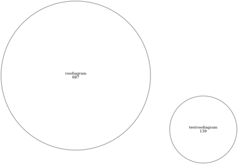
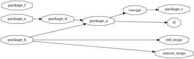
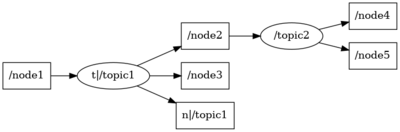
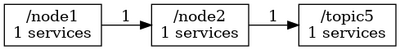

# ROS diagram tools

Generate various aspects of *Robot Operating System* workspace in form of *Graphviz* diagrams.

Package can produce following diagrams:
- source code distribution chart
- packages dependency tree
- *ROS* nodes and topics graphs

## code distribution diagram

Tool presents distribution of code in source subdirectories.

Execution: `./src/rosdiagram/codedistribution.py --help`

## catkin packages tree

Show workspace packages in form of dependency tree.

Execution: `./src/rosdiagram/catkintree.py --help`

## rostopic tree

Present dependecy of *ROS* nodes and topics in form of dependency graph.

Execution: `./src/rosdiagram/rostopictree.py --help`

## rosnode tree

Presents dependecy of *ROS* nodes, topics and services in form of data flow graph.

Execution: `./src/rosdiagram/rosnodetree.py --help`

In addition, for given graph interactive web page can be generated, [example here](example/rosnodelist/out/full_graph.html).

Following animation shows navigation thorough nodes of graph:

## Dumping information

There are additional scripts:
- `./src/dump_rostopic.sh`
- `./src/dump_rosnode.sh`

that dump *ROS* data for further processing. It can be usefull, e.g. if one does not have unrestricted access to *ROS* workspace (Docker container for example).

## References

- [pydotplus](https://pypi.org/project/pydotplus/)
- [Texthon](texthon.chipsforbrain.org/)

## License

BSD 3-Clause License

Copyright (c) 2022, Arkadiusz Netczuk <dev.arnet@gmail.com>

Redistribution and use in source and binary forms, with or without
modification, are permitted provided that the following conditions are met:

1. Redistributions of source code must retain the above copyright notice, this
   list of conditions and the following disclaimer.

2. Redistributions in binary form must reproduce the above copyright notice,
   this list of conditions and the following disclaimer in the documentation
   and/or other materials provided with the distribution.

3. Neither the name of the copyright holder nor the names of its
   contributors may be used to endorse or promote products derived from
   this software without specific prior written permission.

THIS SOFTWARE IS PROVIDED BY THE COPYRIGHT HOLDERS AND CONTRIBUTORS "AS IS"
AND ANY EXPRESS OR IMPLIED WARRANTIES, INCLUDING, BUT NOT LIMITED TO, THE
IMPLIED WARRANTIES OF MERCHANTABILITY AND FITNESS FOR A PARTICULAR PURPOSE ARE
DISCLAIMED. IN NO EVENT SHALL THE COPYRIGHT HOLDER OR CONTRIBUTORS BE LIABLE
FOR ANY DIRECT, INDIRECT, INCIDENTAL, SPECIAL, EXEMPLARY, OR CONSEQUENTIAL
DAMAGES (INCLUDING, BUT NOT LIMITED TO, PROCUREMENT OF SUBSTITUTE GOODS OR
SERVICES; LOSS OF USE, DATA, OR PROFITS; OR BUSINESS INTERRUPTION) HOWEVER
CAUSED AND ON ANY THEORY OF LIABILITY, WHETHER IN CONTRACT, STRICT LIABILITY,
OR TORT (INCLUDING NEGLIGENCE OR OTHERWISE) ARISING IN ANY WAY OUT OF THE USE
OF THIS SOFTWARE, EVEN IF ADVISED OF THE POSSIBILITY OF SUCH DAMAGE.
