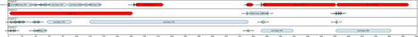

# ROS diagram tools

Generate various aspects of *Robot Operating System* workspace in form of diagrams and graphs.
To produce results package uses *Grpahviz* and *PlanutUML* diagram tools.

Package can produce following diagrams:
- source code distribution chart
- source packages dependency tree
- *ROS* nodes and topics graphs
- *rosbag* sequence graph

In addition there is `rosverifier` tool detecting packages overlay in *catkin* workspace.


## How to use?

1. run *dump* scripts to collect data
2. run diagram tool: `./src/rosdiagramtools.py {tool} {args}`

Depending on desired tool, user can run subset of *dump* scripts. 

Examples of provided diagrams can be seen in `/examples/` repo directory.
First example (`sample`) contains synthetic data. Example `turtlesim` presents 
structure of *turtlesim* tool.


## Requirements

Required dependency packages are needed to be installed before first run of main application. To do it execute one of commands:
- `src/install-deps.sh`
- `pip3 install -r ./src/requirements.txt`

Moreover scripts use command `catkin`. The command is provided by package `python3-catkin-tools` and can be installed by 
`sudo apt install python3-catkin-tools`.


## Tools

List of implemented tools:


### `rosdiagramtools.py codedistribution` - code distribution diagram

Tool presents distribution of code in source subdirectories.

Execution: `./src/rosdiagramtools.py codedistribution --help`

[](examples/simple/codedistribution/out/graph.png)


### `rosdiagramtools.py catkintree` - catkin packages tree

Show workspace packages in form of dependency tree.

Execution: `./src/rosdiagramtools.py catkintree --help`

[](examples/simple/catkinlist/out/graph.png)


### `rosdiagramtools.py classifynodes` - match nodes to packages

Tool tries to match ROS nodes (given by `rosnode` command) to source packages where nodes are implemented.


### `rosdiagramtools.py catkinschedule` - catkin build schedule

Presents schedule graph of workspace build consisting of build time of packages.

Execution: `./src/rosdiagramtools.py catkinschedule --help`

[](doc/turtlesim_catkinschedule.png)

To generate graph execute following steps:
1. build workspace with command `catkin build > build_log.txt`
2. execute tool: 
```
rosdiagramtools.py catkinschedule -la \
                                  -f build_log.txt \
                                  -st 1 -sp 150 \
                                  --outhtml --outdir output_dir
```

Then graph will be available through file: `output_dir/full_graph.html`.

More real-life example is presented on folowing image:
[](doc/schedule-advanced.png)


### `rosdiagramtools.py rosnodetree` - rosnode tree

Presents dependecy of *ROS* nodes, topics and services in form of data flow graph.

Execution: `./src/rosdiagramtools.py rosnodetree --help`

[](examples/simple/rosnodelist/out/full_graph.png)

In addition, for given graph interactive web page can be generated, [example here](examples/simple/rosnodelist/out/full_graph.html).

Following animation shows navigation thorough nodes of graph:


## `rosdiagramtools.py rostopictree` - rostopic tree

Present dependecy of *ROS* nodes and topics in form of dependency graph.

Execution: `./src/rosdiagramtools.py rostopictree --help`

[](examples/simple/rostopiclist/out/graph.png)


## `rosdiagramtools.py rosbagflow` - rosbag graph

Presents visualisation of *ROS* bag in form of sequence graph.

Execution: `./src/rosdiagramtools.py rosbagflow --help`

[](doc/turtlesim_rosbag.png)

Tool generates sequence diagram and interactive web page with following functionalities:
- viewing full graph,
- viewing messages of node and topic,
- viewing message data and message type definition,
- annotating messages with additional information (for example validation messages)

The web page output is stored [here](examples/turtlesim/rosbag/out/full_graph.html).


## `rosdiagramtools.py rosverify` - ROS verifier

Script detects packages overlay in given workspace and extended workspaces.

Execution: `./src/rosdiagramtools.py rosverify --help`

Example output on `turtlesim` generated by command `rosdiagramtools.py rosverify`:
```
INFO:rosdiagram.tool.rosverify:found workspaces: ['/path/to/catkin_ws', '/opt/ros/noetic']
INFO:rosdiagram.tool.rosverify:all overlay packages: []
INFO:rosdiagram.tool.rosverify:workspace overlay packages: []
```


## Dumping information

Dumping required data is split into two scripts:
- `./src/dump_cloc.py` using `cloc` to dump source code info
- `./src/dump_ros.sh` using *ROS* tools and running `rosmaster` to collect data


## References

- [rosbag library](https://ternaris.gitlab.io/rosbags/index.html)
- [pydotplus](https://pypi.org/project/pydotplus/)
- [PlantUML](https://plantuml.com/)
- [GraphViz gallery](https://graphviz.org/gallery/)
- [Texthon](texthon.chipsforbrain.org/)
- [ROS tutorial with examples](https://github.com/ros/ros_tutorials)


## License

BSD 3-Clause License

Copyright (c) 2022, Arkadiusz Netczuk <dev.arnet@gmail.com>

Redistribution and use in source and binary forms, with or without
modification, are permitted provided that the following conditions are met:

1. Redistributions of source code must retain the above copyright notice, this
   list of conditions and the following disclaimer.

2. Redistributions in binary form must reproduce the above copyright notice,
   this list of conditions and the following disclaimer in the documentation
   and/or other materials provided with the distribution.

3. Neither the name of the copyright holder nor the names of its
   contributors may be used to endorse or promote products derived from
   this software without specific prior written permission.

THIS SOFTWARE IS PROVIDED BY THE COPYRIGHT HOLDERS AND CONTRIBUTORS "AS IS"
AND ANY EXPRESS OR IMPLIED WARRANTIES, INCLUDING, BUT NOT LIMITED TO, THE
IMPLIED WARRANTIES OF MERCHANTABILITY AND FITNESS FOR A PARTICULAR PURPOSE ARE
DISCLAIMED. IN NO EVENT SHALL THE COPYRIGHT HOLDER OR CONTRIBUTORS BE LIABLE
FOR ANY DIRECT, INDIRECT, INCIDENTAL, SPECIAL, EXEMPLARY, OR CONSEQUENTIAL
DAMAGES (INCLUDING, BUT NOT LIMITED TO, PROCUREMENT OF SUBSTITUTE GOODS OR
SERVICES; LOSS OF USE, DATA, OR PROFITS; OR BUSINESS INTERRUPTION) HOWEVER
CAUSED AND ON ANY THEORY OF LIABILITY, WHETHER IN CONTRACT, STRICT LIABILITY,
OR TORT (INCLUDING NEGLIGENCE OR OTHERWISE) ARISING IN ANY WAY OUT OF THE USE
OF THIS SOFTWARE, EVEN IF ADVISED OF THE POSSIBILITY OF SUCH DAMAGE.
