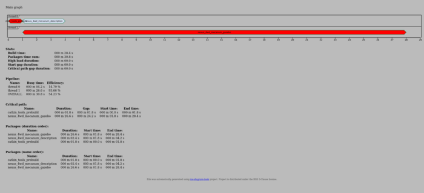
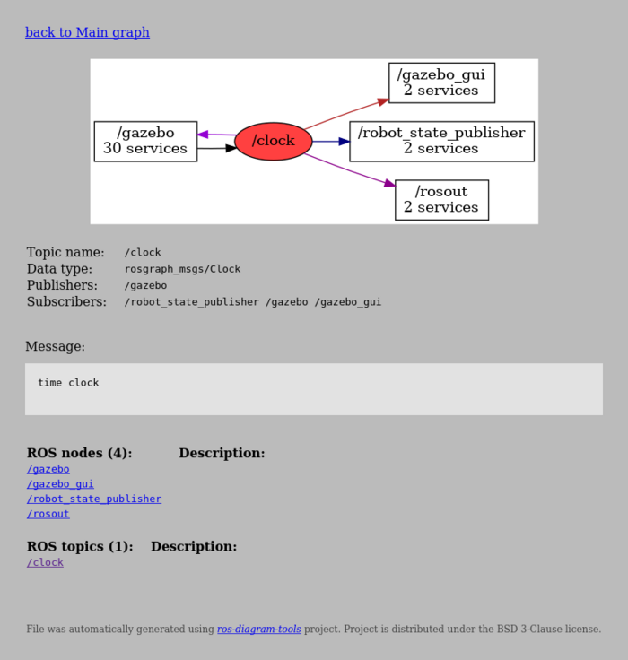
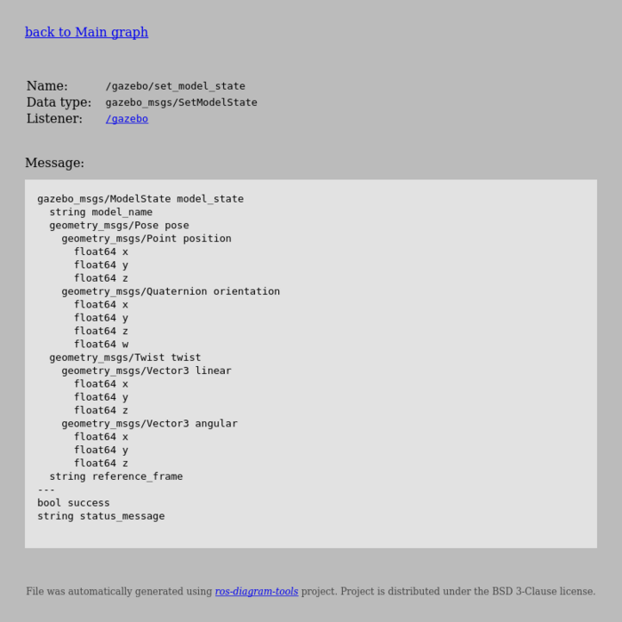

# ROS diagram tools

Generate various aspects of *Robot Operating System* workspace in form of diagrams, graphs and interactive views.
To produce results package uses *Grpahviz* and *PlanutUML* diagram tools.

Package can produce following diagrams:
- source code distribution chart
- source packages dependency tree
- `catkin` packages build schedule
- *ROS* nodes and topics graphs
- *rosbag* sequence graph

In addition there is `rosverifier` tool detecting packages overlay in *catkin* workspace.

Main motivation for the project was to present variuos aspects of *ROS* workspace in easy to understand form.


## How to use?

1. run *dump* scripts to collect data
2. run one of diagram tools: `./src/rosdiagramtools.py {tool} {args}`

Depending on desired tool, user can run subset of *dump* scripts. 

Examples of provided diagrams can be seen in `/examples/` repo directory.
First example (`sample`) contains synthetic data. Example `turtlesim` presents 
structure of *turtlesim* tool.

Whole commands list with description can be found [here](doc/cmd_args.md) by calling `rosdiagramtools.py --help`.


## Requirements

Required dependency packages are needed to be installed before first run of main application. To do it execute one of commands:
- `src/install-deps.sh`
- `pip3 install -r ./src/requirements.txt`

Moreover there are additional required packages: `python3-catkin-tools` (for `catkin`), `python3-rosdep`, `cloc`, 
`imagemagick`, `plantuml`. Installation: 
`sudo apt install python3-catkin-tools python3-rosdep cloc imagemagick plantuml`.


## Examples

In `/examples` there are few examples of generated diagrams:
- artificial [sample](examples/simple)
- [turtlesim](examples/turtlesim): build schedule, ros connections, rosbag sequence
- [turtlebot3](examples/turtlebot3): code distribution, packages tree, build schedule, ros verify
- [mecanum_simulator](examples/mecanum_simulator): code distribution, packages tree, build schedule, nodes classification, ros verify, ros connections


## Tools

Tools are divided into following categories:
- working on source code: `codedistribution`,
- working on catkin workspace: `catkintree`, `catkinschedule`, `rosverify`, `classifynodes`,
- working on running system: `rosnodetree`, `rostopictree`, `rosbagflow`.

From other perspective tools can be split into:
- ones working only with dumped data: `codedistribution`, `catkintree`, `catkinschedule`, `classifynodes`, `rosnodetree`, `rostopictree`, `rosbagflow`,
- ones requiring direct access: `rosverify`


List of tools:


### `rosdiagramtools.py codedistribution`

Tool presents distribution of code in source subdirectories.

Execution: `./src/rosdiagramtools.py codedistribution --help`

[](examples/simple/codedistribution/out/graph.png)


### `rosdiagramtools.py catkintree`

Show workspace packages in form of dependency tree.

Execution: `./src/rosdiagramtools.py catkintree --help`

[](examples/simple/catkinlist/out/graph.png)


### `rosdiagramtools.py classifynodes`

Tool tries to match ROS nodes (given by `rosnode` command) to source packages where nodes are implemented. Result is presented in form 
of text file.

Output example: [mecanum_simulator](examples/mecanum_simulator)


### `rosdiagramtools.py catkinschedule`

Presents schedule graph of workspace build consisting of build time of packages.

Execution: `./src/rosdiagramtools.py catkinschedule --help`

[](doc/turtlesim_catkinschedule.png)

To generate graph execute following steps:
1. build workspace with command `catkin build > build_log.txt`
2. execute tool: 
```
rosdiagramtools.py catkinschedule -la \
                                  -f build_log.txt \
                                  -st 1 -sp 150 \
                                  --outhtml --outdir output_dir
```

Then graph will be available through file: `output_dir/full_graph.html`.

More real-life example with full view is presented on folowing image:

[](examples/mecanum_simulator/out/catkinschedule/main-page.png)


### `rosdiagramtools.py rosverify`

Script detects packages overlay in given workspace and extended workspaces.

Execution: `./src/rosdiagramtools.py rosverify --help`

Example output on `turtlesim` generated by command `rosdiagramtools.py rosverify`:
```
INFO:rosdiagram.tool.rosverify:found workspaces: ['/path/to/catkin_ws', '/opt/ros/noetic']
INFO:rosdiagram.tool.rosverify:all overlay packages: []
INFO:rosdiagram.tool.rosverify:workspace overlay packages: []
```


### `rosdiagramtools.py rosnodetree`

Presents dependecy of *ROS* nodes, topics and services in form of data flow graph.

Execution: `./src/rosdiagramtools.py rosnodetree --help`

[](examples/simple/rosnodelist/out/full_graph.png)

In addition, for given graph interactive web page can be generated, [example here](examples/simple/rosnodelist/out/full_graph.html).

Following animation shows navigation thorough nodes of graph:


Examlpe of topic graph view:

[](examples/mecanum_simulator/out/nodetree/topic-page.png)

Examlpe of service graph view:

[](examples/mecanum_simulator/out/nodetree/service-page.png)


### `rosdiagramtools.py rostopictree`

Present dependecy of *ROS* nodes and topics in form of dependency graph.

Execution: `./src/rosdiagramtools.py rostopictree --help`

[](examples/simple/rostopiclist/out/graph.png)


### `rosdiagramtools.py rosbagflow`

Presents visualisation of *ROS* bag in form of sequence graph.

Execution: `./src/rosdiagramtools.py rosbagflow --help`

[](doc/turtlesim_rosbag.png)

Tool generates sequence diagram and interactive web page with following functionalities:
- viewing full graph,
- viewing messages of node and topic,
- viewing message data and message type definition,
- annotating messages with additional information (for example validation messages)

The web page output is stored [here](examples/turtlesim/rosbag/out/full_graph.html).

Example of node and message view preview can be found here: [turtlesim](examples/turtlesim) 


## Dumping information

Dumping required data is split into several scripts:
- `./src/dump_cloc.py` - stores source code info using `cloc` 
- `./src/dump_ros.sh` - stores *ROS* data using *ROS* tools (requires `rosmaster` to be run)
- `./src/dump_roslaunch.sh` - extracts nodes list spawned by given launch file


## References

- [rosbag library](https://ternaris.gitlab.io/rosbags/index.html)
- [pydotplus](https://pypi.org/project/pydotplus/)
- [PlantUML](https://plantuml.com/)
- [GraphViz gallery](https://graphviz.org/gallery/)
- [Texthon](texthon.chipsforbrain.org/)
- [ROS Robotics Projects](https://github.com/PacktPublishing/ROS-Robotics-Projects)
- [ROS tutorial with examples](https://github.com/ros/ros_tutorials)


## License

BSD 3-Clause License

Copyright (c) 2022, Arkadiusz Netczuk <dev.arnet@gmail.com>

Redistribution and use in source and binary forms, with or without
modification, are permitted provided that the following conditions are met:

1. Redistributions of source code must retain the above copyright notice, this
   list of conditions and the following disclaimer.

2. Redistributions in binary form must reproduce the above copyright notice,
   this list of conditions and the following disclaimer in the documentation
   and/or other materials provided with the distribution.

3. Neither the name of the copyright holder nor the names of its
   contributors may be used to endorse or promote products derived from
   this software without specific prior written permission.

THIS SOFTWARE IS PROVIDED BY THE COPYRIGHT HOLDERS AND CONTRIBUTORS "AS IS"
AND ANY EXPRESS OR IMPLIED WARRANTIES, INCLUDING, BUT NOT LIMITED TO, THE
IMPLIED WARRANTIES OF MERCHANTABILITY AND FITNESS FOR A PARTICULAR PURPOSE ARE
DISCLAIMED. IN NO EVENT SHALL THE COPYRIGHT HOLDER OR CONTRIBUTORS BE LIABLE
FOR ANY DIRECT, INDIRECT, INCIDENTAL, SPECIAL, EXEMPLARY, OR CONSEQUENTIAL
DAMAGES (INCLUDING, BUT NOT LIMITED TO, PROCUREMENT OF SUBSTITUTE GOODS OR
SERVICES; LOSS OF USE, DATA, OR PROFITS; OR BUSINESS INTERRUPTION) HOWEVER
CAUSED AND ON ANY THEORY OF LIABILITY, WHETHER IN CONTRACT, STRICT LIABILITY,
OR TORT (INCLUDING NEGLIGENCE OR OTHERWISE) ARISING IN ANY WAY OUT OF THE USE
OF THIS SOFTWARE, EVEN IF ADVISED OF THE POSSIBILITY OF SUCH DAMAGE.
