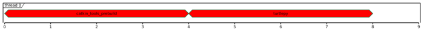
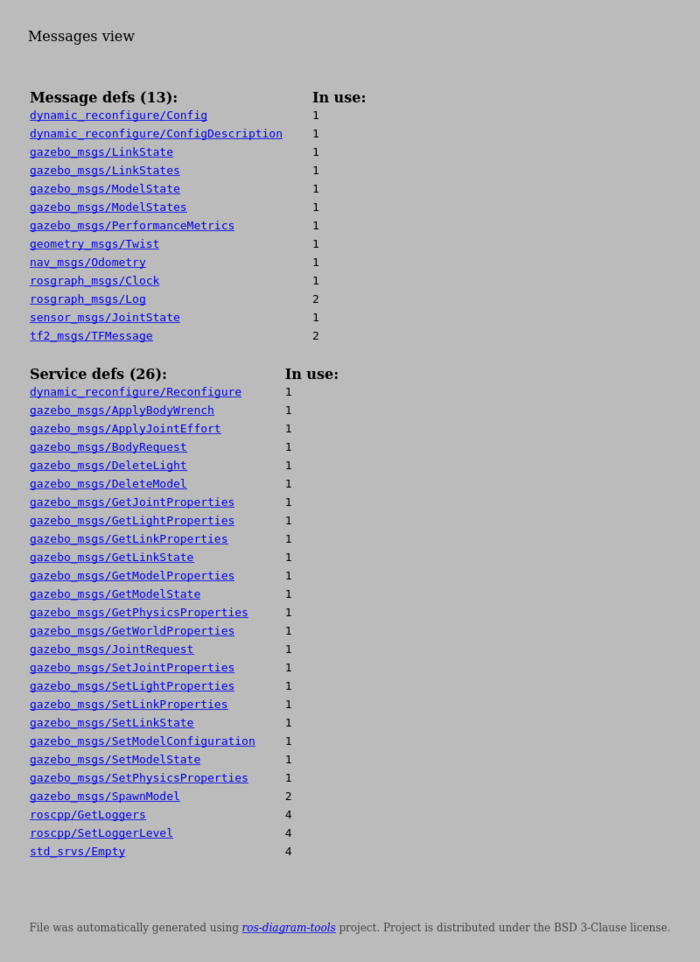
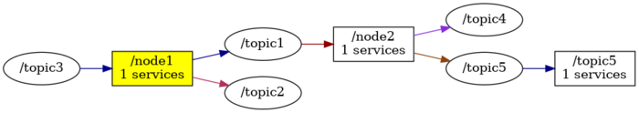
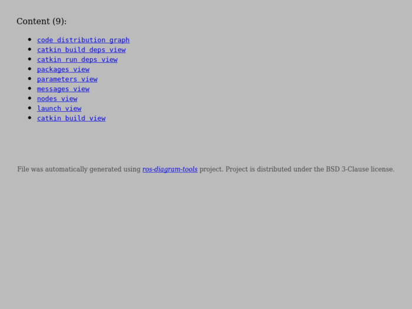
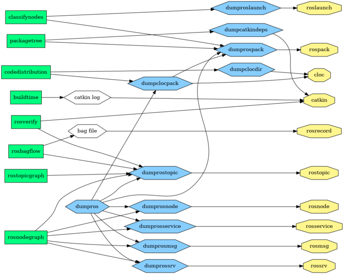

# ROS diagram tools

Generate various aspects of *Robot Operating System* workspace in form of diagrams, graphs and interactive views.
To produce results package uses *Grpahviz* and *PlantUML* diagram tools.

Package can produce following diagrams:
- source code distribution chart
- source packages dependency tree
- `catkin` packages build schedule
- *ROS* nodes and topics graphs
- *rosbag* sequence graph

In addition there is `rosverifier` tool detecting packages overlay in *catkin* workspace.

Main motivation for the project was to present variuos aspects of *ROS* workspace in easy to understand form.


## Table of content

1. [How to use?](#how_to_use)
2. [Requirements](#Requirements)
3. [Examples](#Examples)
4. [The Tools](#tools)
    1. [codedistribution](#codedistribution)
    2. [packagetree](#packagetree)
    3. [classifynodes](#classifynodes)
    4. [buildtime](#buildtime)
    5. [maketime](#maketime)
    6. [rosverify](#rosverify)
    7. [rosparamlist](#rosparamlist)
    8. [rosmsglist](#rosmsglist)
    9. [rosnodegraph](#rosnodegraph)
    10. [rostopicgraph](#rostopicgraph)
    11. [rosindex](#rosindex)
    12. [rosgeneral](#rosgeneral)
    13. [rosbagflow](#rosbagflow)
5. [Comparison with ROS tools](#comparison_ros)
6. [Dumping information](#dumping_info)
7. [References](#References)
8. [License](#License)


## <a name="how_to_use"></a> How to use?

1. run *dump* tools to collect data
2. run one of diagram tools: `./src/rosdiagramtools.py {tool} {args}`

Depending on desired tool, user can run subset of *dump* scripts. 

Examples of provided diagrams can be seen in `/examples/` repo directory.
First example (`sample`) contains synthetic data. Example `turtlesim` presents 
structure of *turtlesim* tool.

Whole commands list with description can be found [here](doc/cmd_args_tools.md) or by calling `rosdiagramtools.py --help`.


## Requirements

Required dependency packages are needed to be installed before first run of main application. To do it execute one of commands:
- `src/install-deps.sh`
- `pip3 install -r ./src/requirements.txt`

Moreover there are additional required packages: `python3-catkin-tools` (for `catkin`), `python3-rosdep`, `cloc`, 
`imagemagick`, `plantuml`. 

Installation: 
`sudo apt install python3-catkin-tools python3-rosdep cloc imagemagick plantuml`.


## Installation

Installation of package can be done by:
 - `install-package.sh` to install package in standard way through `pip`
 - `install-devel.sh` to install package in developer mode
 - to install package from downloaded ZIP file execute: `pip3 install --user file:ros-diagram-tools-master.zip#subdirectory=src`


## Examples

In `/examples` there are few examples of generated diagrams:
- artificial [sample](examples/simple)
- [turtlesim](examples/turtlesim): build schedule, ros connections, rosbag sequence
- [turtlebot3](examples/turtlebot3): code distribution, packages tree, build schedule, ros verify
- [mecanum_simulator](examples/mecanum_simulator): code distribution, packages tree, build schedule, nodes classification, ros verify, ros connections


## <a name="tools"></a> The Tools

Tools are divided into following categories:
- working on source code: `codedistribution`,
- working on ROS workspace: `packagetree`, `buildtime`, `rosverify`, `classifynodes`,
- working on running ROS master: `rosparamlist`, `rosmsglist`, `rosnodegraph`, `rostopicgraph`, `rosbagflow`.

From other perspective tools can be split into:
- ones working with dumped data: `codedistribution`, `packagetree`, `buildtime`, `classifynodes`, `rosparamlist`,
`rosmsglist`, `rosnodegraph`, `rostopicgraph`, `rosbagflow`,
- ones requiring direct access: `rosverify`


List of tools:


### <a name="codedistribution"></a> `rosdiagramtools.py codedistribution`

Tool presents distribution of code in source subdirectories.

Help: `./src/rosdiagramtools.py codedistribution --help`

Help [output](doc/cmd_args_tools.md#codedistribution_help).

[](examples/simple/codedistribution/out/graph.png)


### <a name="packagetree"></a> `rosdiagramtools.py packagetree`

Show workspace packages in form of dependency tree. Graph presents package build dependencies defined in *package.xml*.

Help: `./src/rosdiagramtools.py packagetree --help`

Help [output](doc/cmd_args_tools.md#packagetree_help).

[](examples/turtlebot3/out/catkintree/full_graph.png)


### <a name="classifynodes"></a> `rosdiagramtools.py classifynodes`

Tool tries to match ROS nodes (given by `rosnode` command) to source packages where nodes are implemented. Result is presented in form 
of text file.

Help: `./src/rosdiagramtools.py classifynodes --help`

Help [output](doc/cmd_args_tools.md#classifynodes_help).

Output example: [mecanum_simulator](examples/mecanum_simulator#classifynodes)


### <a name="buildtime"></a> `rosdiagramtools.py buildtime`

Presents build time and order of packages in workspace.

Help: `./src/rosdiagramtools.py buildtime --help`

Help [output](doc/cmd_args_tools.md#classifynodes_help).

[](doc/turtlesim_catkinschedule.png)

To generate graph execute following steps:
1. build workspace with command `catkin build | tee build_log.txt`
2. execute tool: 
```
rosdiagramtools.py buildtime -la \
                             --buildlogfile build_log.txt \
                             -st 1 -sp 150 \
                             --outhtml --outdir output_dir
```

Then graph will be available through file: `output_dir/full_graph.html`.

More real-life example with full view is presented on folowing image:

[](examples/turtlebot3/out/catkinschedule/main-page.png)


### <a name="maketime"></a> `rosdiagramtools.py maketime`

Calculate compilation time of objects under `make`. Calculation is done by analyzing log file. The log have to be obtained 
running following command:
```
make -j1 <optional_targets> | ts '[%H:%M:%.S]' | tee compile_log.txt
```

Tool output is presented in form of sorted list cntaining object name and it's compilation time.

Help: `./src/rosdiagramtools.py maketime --help`

Help [output](doc/cmd_args_tools.md#maketime_help).


### <a name="rosverify"></a> `rosdiagramtools.py rosverify`

Script detects packages overlay in given workspace and extended workspaces.

Help: `./src/rosdiagramtools.py rosverify --help`

Help [output](doc/cmd_args_tools.md#rosverify_help).

Example output on `turtlesim` generated by command `rosdiagramtools.py rosverify`:
```
INFO:rosdiagram.tool.rosverify:found workspaces: ['/path/to/catkin_ws', '/opt/ros/noetic']
INFO:rosdiagram.tool.rosverify:all overlay packages: []
INFO:rosdiagram.tool.rosverify:workspace overlay packages: []
```


### <a name="rosparamlist"></a> `rosdiagramtools.py rosparamlist`

Presents list of *ROS* parameters with values.

Help: `./src/rosdiagramtools.py rosparamlist --help`

Help [output](doc/cmd_args_tools.md#rosparamlist_help).

[](examples/mecanum_simulator/out/general/paramview-page.png)


### <a name="rosmsglist"></a> `rosdiagramtools.py rosmsglist`

Presents list of *ROS* messages and services with definitions.

Help: `./src/rosdiagramtools.py rosmsglist --help`

Help [output](doc/cmd_args_tools.md#rosmsglist_help).

[](examples/mecanum_simulator/out/general/msgview-page.png)


### <a name="rosnodegraph"></a> `rosdiagramtools.py rosnodegraph`

Presents dependecy of *ROS* nodes, topics and services in form of data flow graph.

Help: `./src/rosdiagramtools.py rosnodegraph --help`

Help [output](doc/cmd_args_tools.md#rosnodegraph_help).

[](examples/simple/rosnodelist/out/full_graph.png)

In addition, for given graph interactive web page can be generated, [example here](examples/simple/rosnodelist/out/full_graph.html).

Following animation shows navigation thorough nodes of graph:


Example of topic graph view:

[](examples/mecanum_simulator/out/general/nodeview-topic-page.png)

Example of service graph view:

[](examples/mecanum_simulator/out/general/nodeview-service-page.png)


### <a name="rostopicgraph"></a> `rosdiagramtools.py rostopicgraph`

Present dependecy of *ROS* nodes and topics in form of dependency graph.

Help: `./src/rosdiagramtools.py rostopicgraph --help`

Help [output](doc/cmd_args_tools.md#rostopicgraph_help).

[](examples/simple/rostopiclist/out/graph.png)

Note: tool is considered deprecated, so please use `rosnodegraph` tool.


### <a name="rosindex"></a> `rosdiagramtools.py rosindex`

Generates simple index page containing links to any content.

Help: `./src/rosdiagramtools.py rosindex --help`

Help [output](doc/cmd_args_tools.md#rosindex_help).

[](examples/mecanum_simulator/out/index/main-page.png)


### <a name="rosgeneral"></a> `rosdiagramtools.py rosgeneral`

Generates diagrams from data generated by `dumpros` tool.

Those diagrams are:
- code distribution through packages (`codedistribution`)
- packages tree (`packagetree`)
- parameters list (`rosparamlist`)
- messages list (`rosmsglist`)
- nodes graph (`rosnodegraph`)

Help: `./src/rosdiagramtools.py rosgeneral --help`

Help [output](doc/cmd_args_tools.md#rosgeneral_help).

[](examples/mecanum_simulator/out/general/main-page.png)


### <a name="rosbagflow"></a> `rosdiagramtools.py rosbagflow`

Presents visualisation of *ROS* bag in form of sequence graph.

Help: `./src/rosdiagramtools.py rosbagflow --help`

Help [output](doc/cmd_args_tools.md#rosbagflow_help).

[](doc/turtlesim_rosbag.png)

Tool generates sequence diagram and interactive web page with following functionalities:
- viewing full graph,
- viewing messages of node and topic,
- viewing message data and message type definition,
- annotating messages with additional information (for example validation messages)

The web page output is stored [here](examples/turtlesim/rosbag/out/full_graph.html).

Example of node and message view preview can be found here: [turtlesim](examples/turtlesim) 


## <a name="comparison_ros"></a> Comparison with ROS tools

- `codedistribution` does not have equivalent,
- `packagetree` presents similar results to `rqt_dep`, but limited only to workspace packages and it's build 
dependencies. `rqt_dep` presents packages full tree of runtime dependencies,
- `classifynodes` does not have equivalent,
- `buildtime` does not have equivalent,
- `rosnodegraph` presents similar results to `rqt_graph`. Focuses more on connections between nodes and messages,
- `rostopicgraph` presents similar results to `rqt_graph`. Presents connection graph of nodes,
- `rosbagflow` presents similar results to `rqt_bag`. Emphasises communication between nodes and time relation between messages.
Using `rqt_bag` it is hardly possible to read senders and receivers of messages,
- `rosverify` and `rosbagflow` can be used to verify certain aspects of system. ROS also have tool dedicated for looking 
for potential issues - it is `roswtf`. 

Moreover with *diagram tools* it is possible to generate and store diagram images in automated way serving for example 
for documentation purposes.

From the other hand, diagram tools are not capable of presenting state changes of running system like in `rqt_bag`. The 
tools just makes snapshot of the system in certain moment.


## <a name="dumping_info"></a> Dumping information

Dumping data is done through `rosdiagramdump.py` script. Description of arguments can be found [here](doc/cmd_args_dump.md) or 
by calling `rosdiagramdump.py --help`.

Dump tools:
- `dumpclocdir` - dump result of `cloc` command on given directory
- `dumpcatkindeps` - dump catkin dependencies of packages in workspace (from package.xml)
- `dumprospack` - dump data from `rospack`
- `dumprosmsg` - dump messages info
- `dumprossrv` - dump services definitions
- `dumprosnode` - dump nodes info
- `dumprostopic` - dump topics info
- `dumprosservice` - dump services info
- `dumproslaunch` - dump node names of launch file
- `dumpros` - dump majority of data (uses above mentioned dump tools)
- `extractscripts` - extract embedded scripts to files

Tools can be divided into following categories:
- working on source code: `dumpclocdir`,
- working on ROS workspace: `dumpcatkindeps`, `dumprospack`, `dumprosmsg`,`dumprossrv`, `dumproslaunch`,
- working on running ROS master: `dumprosnode`, `dumprostopic`, `dumprosservice`, `dumpros`.


Dependency graph between tools, dump scripts and external executables is presented on following graph:

[](doc/tools_graph/tools_graph.png)


## References

- [rosbag library](https://ternaris.gitlab.io/rosbags/index.html)
- [pydotplus](https://pypi.org/project/pydotplus/)
- [PlantUML](https://plantuml.com/)
- [GraphViz gallery](https://graphviz.org/gallery/)
- [Texthon](http://texthon.chipsforbrain.org/)
- [Turtlebot3](https://github.com/ROBOTIS-GIT/turtlebot3)
- [Nexus 4WD Mecanum Simulator](https://github.com/RBinsonB/nexus_4wd_mecanum_simulator)


## License

BSD 3-Clause License

Copyright (c) 2022, Arkadiusz Netczuk <dev.arnet@gmail.com>

Redistribution and use in source and binary forms, with or without
modification, are permitted provided that the following conditions are met:

1. Redistributions of source code must retain the above copyright notice, this
   list of conditions and the following disclaimer.

2. Redistributions in binary form must reproduce the above copyright notice,
   this list of conditions and the following disclaimer in the documentation
   and/or other materials provided with the distribution.

3. Neither the name of the copyright holder nor the names of its
   contributors may be used to endorse or promote products derived from
   this software without specific prior written permission.

THIS SOFTWARE IS PROVIDED BY THE COPYRIGHT HOLDERS AND CONTRIBUTORS "AS IS"
AND ANY EXPRESS OR IMPLIED WARRANTIES, INCLUDING, BUT NOT LIMITED TO, THE
IMPLIED WARRANTIES OF MERCHANTABILITY AND FITNESS FOR A PARTICULAR PURPOSE ARE
DISCLAIMED. IN NO EVENT SHALL THE COPYRIGHT HOLDER OR CONTRIBUTORS BE LIABLE
FOR ANY DIRECT, INDIRECT, INCIDENTAL, SPECIAL, EXEMPLARY, OR CONSEQUENTIAL
DAMAGES (INCLUDING, BUT NOT LIMITED TO, PROCUREMENT OF SUBSTITUTE GOODS OR
SERVICES; LOSS OF USE, DATA, OR PROFITS; OR BUSINESS INTERRUPTION) HOWEVER
CAUSED AND ON ANY THEORY OF LIABILITY, WHETHER IN CONTRACT, STRICT LIABILITY,
OR TORT (INCLUDING NEGLIGENCE OR OTHERWISE) ARISING IN ANY WAY OUT OF THE USE
OF THIS SOFTWARE, EVEN IF ADVISED OF THE POSSIBILITY OF SUCH DAMAGE.
