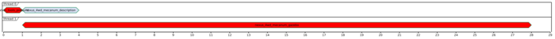

## Example of diagrams over Turtlebot3

*Nexus 4WD Mecanum Simulator* project is taken from (https://github.com/RBinsonB/nexus_4wd_mecanum_simulator) (commit `e26640c600050b3da95312885d6a6e4de0786ff6`).
Project is published on GPL-3.0 license.


### Generation

Dumping required data is done by script `dump.sh`. Script have to be run from environment with installed *ROS*.
Script `generate.sh` generates diagrams and views from duped data.


### Diagrams

#### `codedistribution`

[](out/codedistribution.png)

#### `catkintree`

[](out/catkintree/full_graph.png)

#### `catkinschedule`

[](out/catkinschedule/schedule.png)

#### `rosverify`

```
INFO:rosdiagram.tool.rosverify:found workspaces: ['/home/vbox/rosdiagrams/turtlebot3/catkin_ws', '/opt/ros/noetic']
INFO:rosdiagram.tool.rosverify:all overlay packages: []
INFO:rosdiagram.tool.rosverify:workspace overlay packages: []

```

#### `rosnodetree`

[](out/nodetree/full_graph.png)

#### `rostopictree`

[](out/topictree/graph.png)
