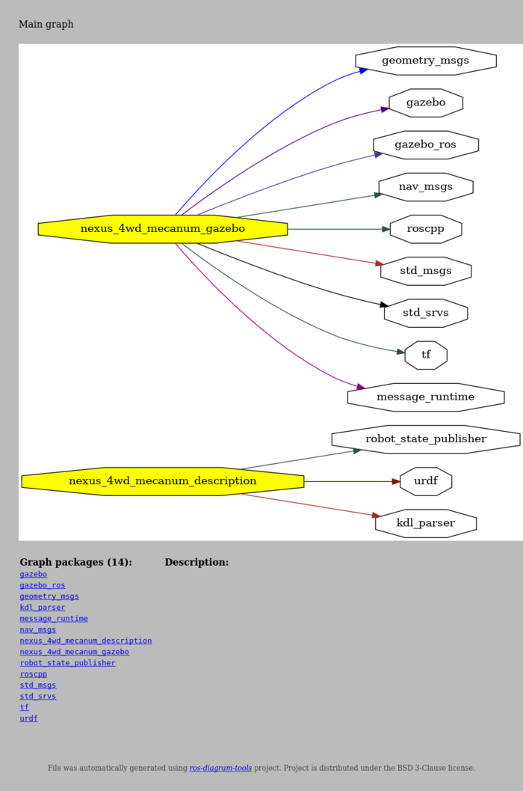
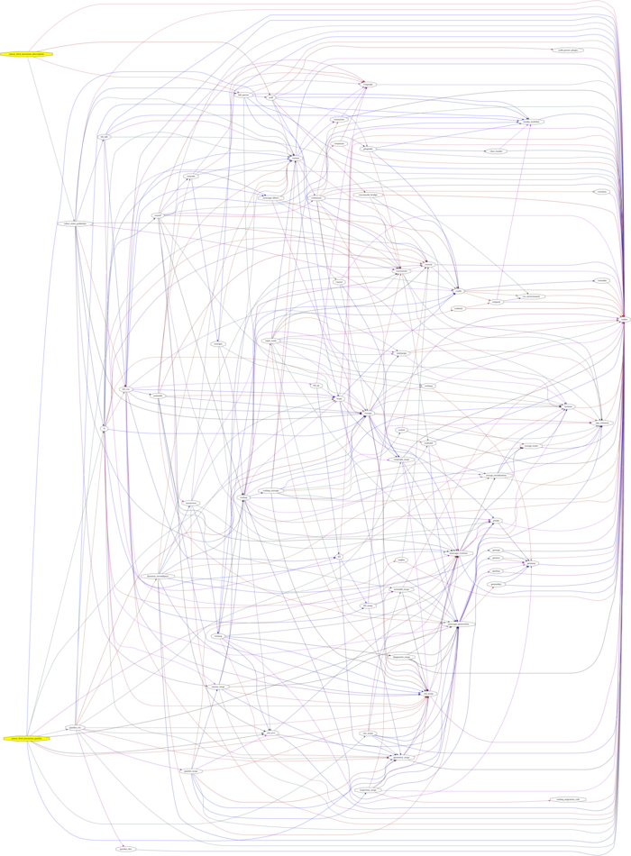
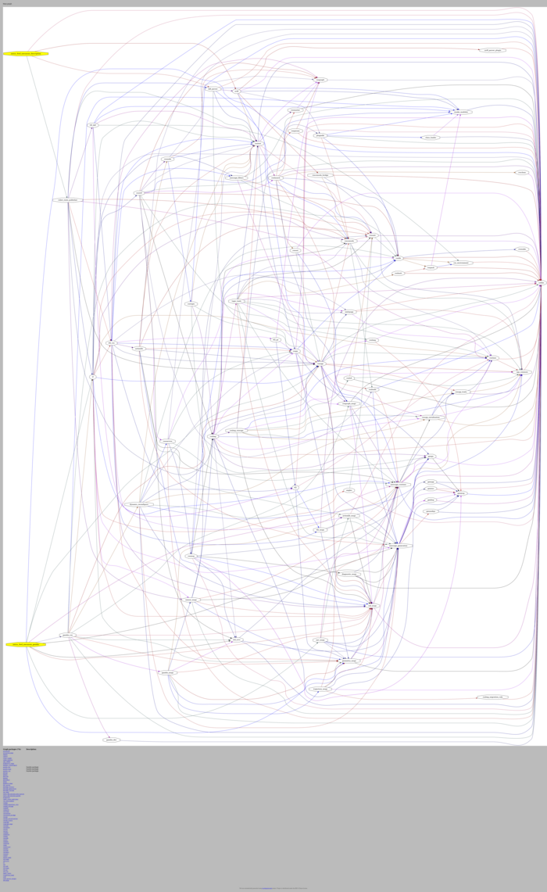
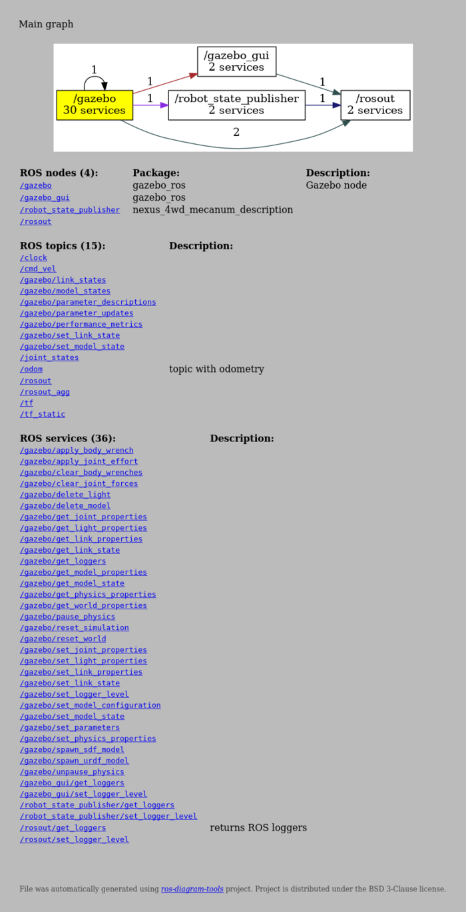
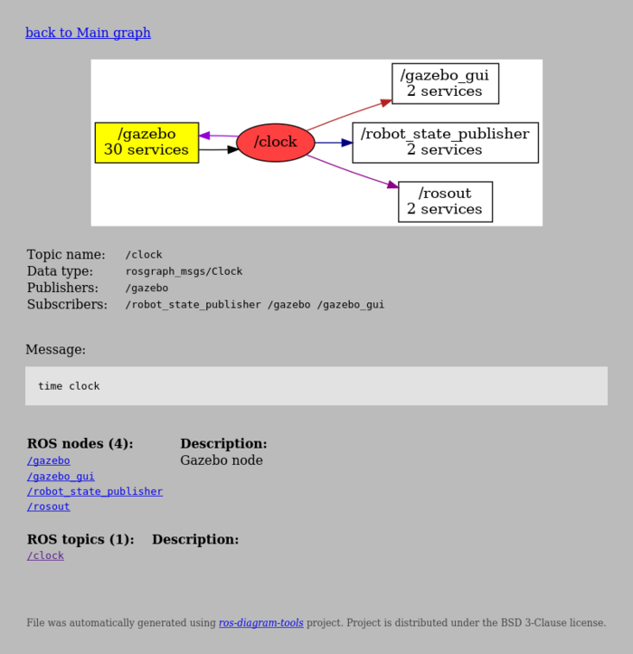
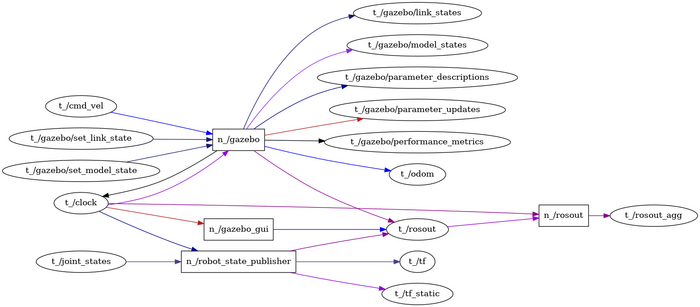
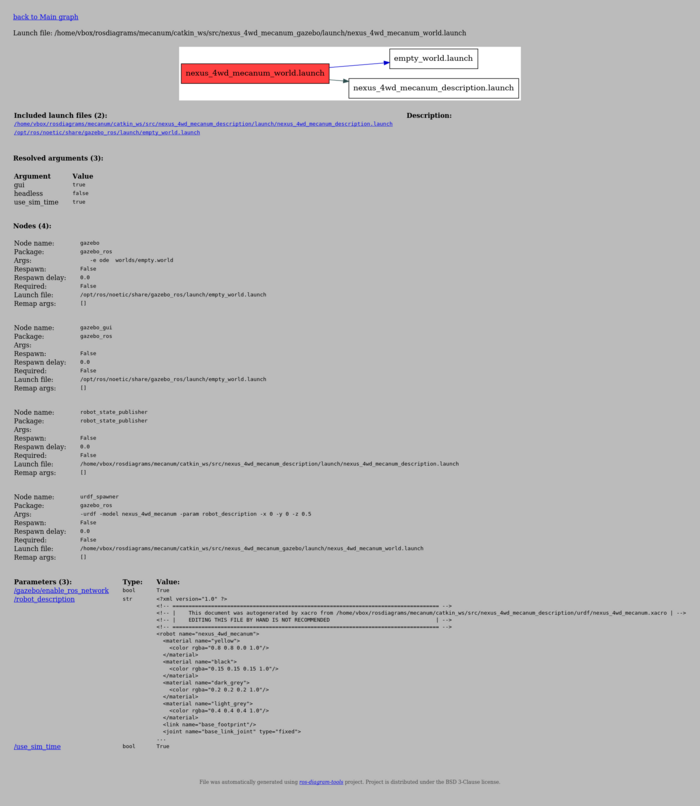

# Example of diagrams over Nexus 4WD Mecanum Simulator

*Nexus 4WD Mecanum Simulator* project is taken from (https://github.com/RBinsonB/nexus_4wd_mecanum_simulator) (commit `e26640c600050b3da95312885d6a6e4de0786ff6`).
Project is published on GPL-3.0 license.


## Generation

Dumping required data is done by script `dump.sh`. Script have to be run from environment with installed *ROS*.
Script `generate.sh` generates diagrams and views from duped data.


## `codedistribution` over `dumpclocdir` dump

[](out/codedistribution/full_graph.png)

*HTML* [output](out/codedistribution/full_graph.html).

*Markdown* [output](out/codedistribution/full_graph.md).


## `codedistribution` over `dumpclocpack` dump

[](out/general/clockpackview/full_graph.png)

*HTML* [output](out/general/clockpackview/full_graph.html).

*Markdown* [output](out/general/clockpackview/full_graph.md).


## `packagetree` over `dumpcatkindeps` dump

Generated diagram:

[](out/catkintree/full_graph.png)

Generated main graph view:

[](out/catkintree/main-page.png)

Generated package graph view:

[](out/catkintree/node-page.png)

*HTML* [output](out/catkintree/full_graph.html).

*Markdown* [output](out/catkintree/full_graph.md).


## `packagetree` over `dumprospack` dump

Generated diagram:

[](out/general/packageview/full_graph.png)

Generated main graph view:

[](out/general/packageview-main-page.png)

*HTML* [output](out/general/packageview/full_graph.html).

*Markdown* [output](out/general/packageview/full_graph.md).


## `buildtime`

Generated diagram:

[](out/catkinschedule/schedule.png)

Generated main graph view:

[](out/catkinschedule/main-page.png)

*HTML* [output](out/catkinschedule/full_graph.html).

*Markdown* [output](out/catkinschedule/full_graph.md).


## `classifynodes`

```
{
    "gazebo_ros": {
        "path": "/opt/ros/noetic/share/gazebo_ros",
        "nodes": [
            "/gazebo",
            "/gazebo_gui"
        ]
    },
    "nexus_4wd_mecanum_description": {
        "path": "/home/vbox/rosdiagrams/mecanum/catkin_ws/src/nexus_4wd_mecanum_description",
        "nodes": [
            "/robot_state_publisher"
        ]
    },
    "nexus_4wd_mecanum_gazebo": {
        "path": "/home/vbox/rosdiagrams/mecanum/catkin_ws/src/nexus_4wd_mecanum_gazebo",
        "nodes": [
            "/gazebo",
            "/gazebo_gui",
            "/robot_state_publisher",
            "/urdf_spawner"
        ]
    }
}

```


## `rosverify`

```
INFO:rosdiagram.tool.rosverify:found workspaces: ['/home/vbox/rosdiagrams/turtlebot3/catkin_ws', '/opt/ros/noetic']
INFO:rosdiagram.tool.rosverify:all overlay packages: []
INFO:rosdiagram.tool.rosverify:workspace overlay packages: []

```


## `rosnodegraph`

Generated full diagram:

[](out/nodetree/whole_graph.png)

Generated main graph view:

[](out/general/nodeview-main-page.png)

Generated node graph view:

[](out/general/nodeview-node-page.png)

Generated topic graph view:

[](out/general/nodeview-topic-page.png)

Generated service graph view:

[](out/general/nodeview-service-page.png)

*HTML* [output](out/general/nodeview/full_graph.html).

*Markdown* [output](out/general/nodeview/full_graph.md).


## `rostopicgraph`

[](out/topictree/graph.png)


## `roslaunchgraph`

Generated main view:

[](out/general/launchview-main-page.png)

Generated file view:

[](out/general/launchview-file-page.png)

*HTML* [output](out/general/launchview/full_graph.html).

*Markdown* [output](out/general/launchview/full_graph.md).


## `rosgeneral`

*HTML* [output](out/general/main_page.html).

*Markdown* [output](out/general/main_page.md).
