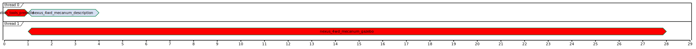

<!--
File was automatically generated using 'ros-diagram-tools' project.
Project is distributed under the BSD 3-Clause license.
-->

## build schedule graph

**Stats:**

|     |     |
| --- | --- |
| **Build time:** | 000 m 28.4 s |
| **Packages time sum:** | 000 m 30.8 s |
| **High load duration:** | 000 m 00.0 s |
| **Start gap duration:** | 000 m 00.0 s |
| **Critical path gap duration:** | 000 m 00.0 s |

**Pipeline:**

| Name: | Busy time: | Efficiency: |
| ----- | ---------- | ----------- |
| thread 0 | 000 m 04.2 s | 14.79 % |
| thread 1 | 000 m 26.6 s | 93.66 % |
| OVERALL | 000 m 30.8 s | 54.23 % |

**Critical path:**

| Name: | Duration: | Gap: | Start time: | End time: |
| ----- | --------- | ---- | ----------- | --------- |
| catkin_tools_prebuild | 000 m 01.8 s | 000 m 01.8 s | 000 m 00.0 s | 000 m 01.8 s |
| nexus_4wd_mecanum_gazebo | 000 m 26.6 s | 000 m 24.2 s | 000 m 01.8 s | 000 m 28.4 s |

**Packages (duration order):**

| Name: | Duration: | Start time: | End time: |
| ----- | --------- | ----------- | --------- |
| nexus_4wd_mecanum_gazebo | 000 m 26.6 s | 000 m 01.8 s | 000 m 28.4 s |
| nexus_4wd_mecanum_description | 000 m 02.4 s | 000 m 01.8 s | 000 m 04.2 s |
| catkin_tools_prebuild | 000 m 01.8 s | 000 m 00.0 s | 000 m 01.8 s |

**Packages (name order):**

| Name: | Duration: | Start time: | End time: |
| ----- | --------- | ----------- | --------- |
| catkin_tools_prebuild | 000 m 01.8 s | 000 m 00.0 s | 000 m 01.8 s |
| nexus_4wd_mecanum_description | 000 m 02.4 s | 000 m 01.8 s | 000 m 04.2 s |
| nexus_4wd_mecanum_gazebo | 000 m 26.6 s | 000 m 01.8 s | 000 m 28.4 s |

 

File was automatically generated using <a href="https://github.com/anetczuk/ros-diagram-tools"><i>ros-diagram-tools</i></a> project.
Project is distributed under the BSD 3-Clause license.

