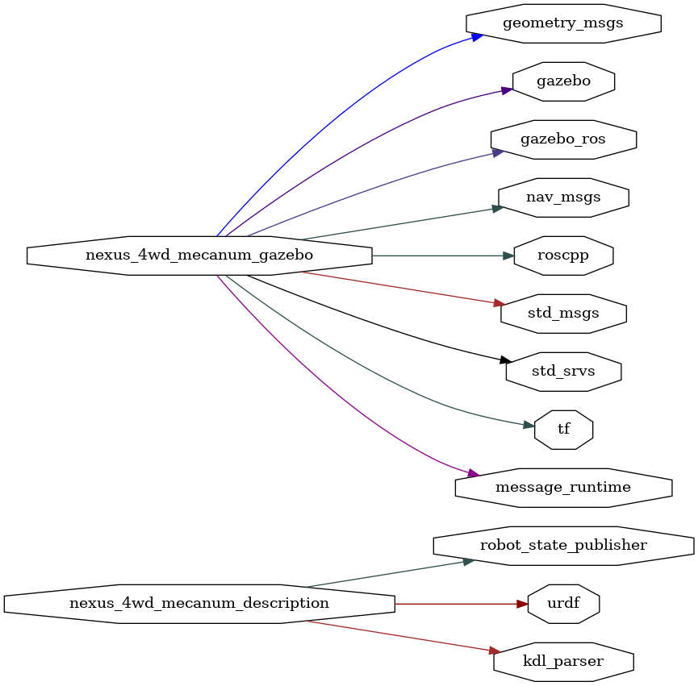

<!--
File was automatically generated using 'ros-diagram-tools' project.
Project is distributed under the BSD 3-Clause license.
-->

## packages graph

| Graph packages (14): | Description: |
| ----------------------------------- | ------------ |
| [`gazebo`](nodes/gazebo.html) |  |
| [`gazebo_ros`](nodes/gazebo_ros.html) |  |
| [`geometry_msgs`](nodes/geometry_msgs.html) |  |
| [`kdl_parser`](nodes/kdl_parser.html) |  |
| [`message_runtime`](nodes/message_runtime.html) |  |
| [`nav_msgs`](nodes/nav_msgs.html) |  |
| [`nexus_4wd_mecanum_description`](nodes/nexus_4wd_mecanum_description.html) |  |
| [`nexus_4wd_mecanum_gazebo`](nodes/nexus_4wd_mecanum_gazebo.html) |  |
| [`robot_state_publisher`](nodes/robot_state_publisher.html) |  |
| [`roscpp`](nodes/roscpp.html) |  |
| [`std_msgs`](nodes/std_msgs.html) |  |
| [`std_srvs`](nodes/std_srvs.html) |  |
| [`tf`](nodes/tf.html) |  |
| [`urdf`](nodes/urdf.html) |  |

 

File was automatically generated using <a href="https://github.com/anetczuk/ros-diagram-tools"><i>ros-diagram-tools</i></a> project.
Project is distributed under the BSD 3-Clause license.

