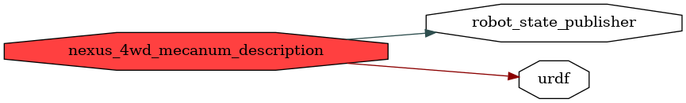

<!--
File was automatically generated using 'ros-diagram-tools' project.
Project is distributed under the BSD 3-Clause license.
-->

## packages graph

|     |     |
| --- | --- |
| Package path: | `/home/vbox/rosdiagrams/mecanum/catkin_ws/src/nexus_4wd_mecanum_description` |
| Nodes: | `/robot_state_publisher` |
| Graph packages (3): | Description: |
| ----------------------------------- | ------------ |
| [`nexus_4wd_mecanum_description`](nexus_4wd_mecanum_description.html) |  |
| [`robot_state_publisher`](robot_state_publisher.html) |  |
| [`urdf`](urdf.html) |  |

 
File was automatically generated using [*ros-diagram-tools*](https://github.com/anetczuk/ros-diagram-tools) project.
Project is distributed under the BSD 3-Clause license.
