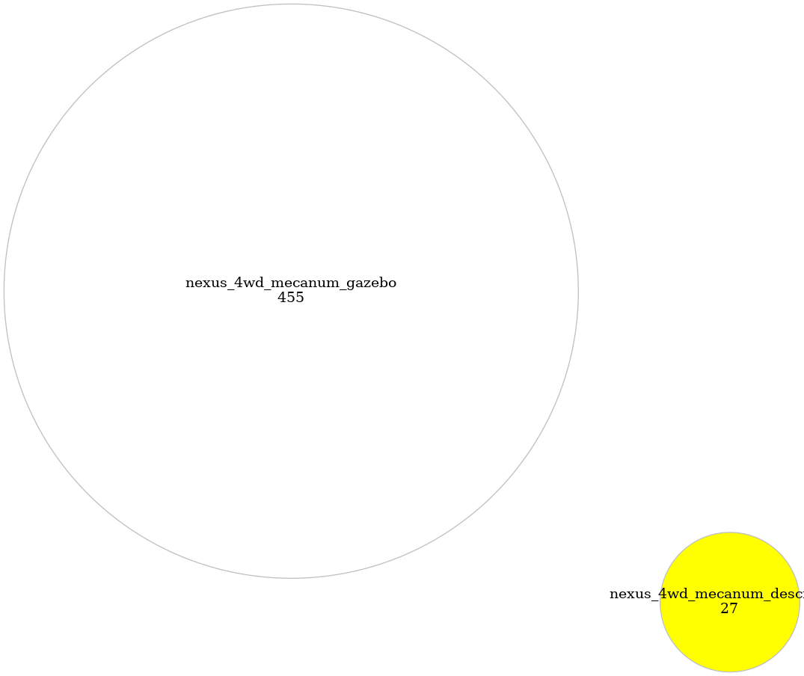

<!--
File was automatically generated using 'ros-diagram-tools' project.
Project is distributed under the BSD 3-Clause license.
-->

## cloc graph

| Packages (2): | Lines number: |
| --- | --- |
| [nexus_4wd_mecanum_description](data/_home_vbox_rosdiagrams_mecanum_catkin_ws_src_nexus_4wd_mecanum_description.txt) | `27` |
| [nexus_4wd_mecanum_gazebo](data/_home_vbox_rosdiagrams_mecanum_catkin_ws_src_nexus_4wd_mecanum_gazebo.txt) | `455` |

 

File was automatically generated using <a href="https://github.com/anetczuk/ros-diagram-tools"><i>ros-diagram-tools</i></a> project.
Project is distributed under the BSD 3-Clause license.

