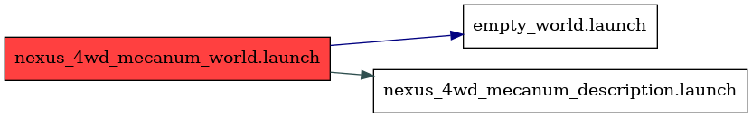

<!--
File was automatically generated using 'ros-diagram-tools' project.
Project is distributed under the BSD 3-Clause license.
-->

## Node

Launch file: /home/vbox/rosdiagrams/mecanum/catkin_ws/src/nexus_4wd_mecanum_gazebo/launch/nexus_4wd_mecanum_world.launch

Nodes (4):

|     |     |
| --- | --- |
| Node name: | `gazebo` |
| Package: | `gazebo_ros` |
| Args: | `   -e ode  worlds/empty.world` |
| Respawn: | `False` |
| Respawn delay: | `0.0` |
| Required: | `False` |
| Launch file: | `/opt/ros/noetic/share/gazebo_ros/launch/empty_world.launch` |
| Remap args: | `[]` |
|     |     |
| --- | --- |
| Node name: | `gazebo_gui` |
| Package: | `gazebo_ros` |
| Args: | `` |
| Respawn: | `False` |
| Respawn delay: | `0.0` |
| Required: | `False` |
| Launch file: | `/opt/ros/noetic/share/gazebo_ros/launch/empty_world.launch` |
| Remap args: | `[]` |
|     |     |
| --- | --- |
| Node name: | `robot_state_publisher` |
| Package: | `robot_state_publisher` |
| Args: | `` |
| Respawn: | `False` |
| Respawn delay: | `0.0` |
| Required: | `False` |
| Launch file: | `/home/vbox/rosdiagrams/mecanum/catkin_ws/src/nexus_4wd_mecanum_description/launch/nexus_4wd_mecanum_description.launch` |
| Remap args: | `[]` |
|     |     |
| --- | --- |
| Node name: | `urdf_spawner` |
| Package: | `gazebo_ros` |
| Args: | `-urdf -model nexus_4wd_mecanum -param robot_description -x 0 -y 0 -z 0.5` |
| Respawn: | `False` |
| Respawn delay: | `0.0` |
| Required: | `False` |
| Launch file: | `/home/vbox/rosdiagrams/mecanum/catkin_ws/src/nexus_4wd_mecanum_gazebo/launch/nexus_4wd_mecanum_world.launch` |
| Remap args: | `[]` |

| Parameters (3): | Type: | Value: |
| --------------- | ----- | ------ |
| [/gazebo/enable_ros_network](_gazebo_enable_ros_network.txt) | `bool` | `True` |
| [/robot_description](_robot_description.txt) | `str` | `&lt;?xml version=&quot;1.0&quot; ?&gt;
&lt;!-- =================================================================================== --&gt;
&lt;!-- |    This document was autogenerated by xacro from /home/vbox/rosdiagrams/mecanum/catkin_ws/src/nexus_4wd_mecanum_description/urdf/nexus_4wd_mecanum.xacro | --&gt;
&lt;!-- |    EDITING THIS FILE BY HAND IS NOT RECOMMENDED                                 | --&gt;
&lt;!-- =================================================================================== --&gt;
&lt;robot name=&quot;nexus_4wd_mecanum&quot;&gt;
  &lt;material name=&quot;yellow&quot;&gt;
    &lt;color rgba=&quot;0.8 0.8 0.0 1.0&quot;/&gt;
  &lt;/material&gt;
  &lt;material name=&quot;black&quot;&gt;
    &lt;color rgba=&quot;0.15 0.15 0.15 1.0&quot;/&gt;
  &lt;/material&gt;
  &lt;material name=&quot;dark_grey&quot;&gt;
    &lt;color rgba=&quot;0.2 0.2 0.2 1.0&quot;/&gt;
  &lt;/material&gt;
  &lt;material name=&quot;light_grey&quot;&gt;
    &lt;color rgba=&quot;0.4 0.4 0.4 1.0&quot;/&gt;
  &lt;/material&gt;
  &lt;link name=&quot;base_footprint&quot;/&gt;
  &lt;joint name=&quot;base_link_joint&quot; type=&quot;fixed&quot;&gt;
...` |
| [/use_sim_time](_use_sim_time.txt) | `bool` | `True` |

 

File was automatically generated using <a href="https://github.com/anetczuk/ros-diagram-tools"><i>ros-diagram-tools</i></a> project.
Project is distributed under the BSD 3-Clause license.

