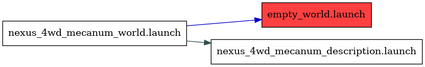

<!--
File was automatically generated using 'ros-diagram-tools' project.
Project is distributed under the BSD 3-Clause license.
-->

## Node

Launch file: /opt/ros/noetic/share/gazebo_ros/launch/empty_world.launch

#### Resolved arguments (21):

| Argument | Value |
| -------- | ----- |
| command_arg1 | `` |
| command_arg2 | `` |
| command_arg3 | `` |
| debug | `0` |
| enable_ros_network | `true` |
| extra_gazebo_args | `` |
| gui | `true` |
| gui_required | `false` |
| headless | `false` |
| output | `screen` |
| paused | `false` |
| physics | `ode` |
| pub_clock_frequency | `100` |
| recording | `false` |
| respawn_gazebo | `false` |
| script_type | `gzserver` |
| server_required | `false` |
| use_clock_frequency | `false` |
| use_sim_time | `true` |
| verbose | `false` |
| world_name | `worlds/empty.world` |

#### Nodes (2):

|     |     |
| --- | --- |
| Node name: | `gazebo` |
| Package: | `gazebo_ros` |
| Args: | `   -e ode  worlds/empty.world` |
| Respawn: | `False` |
| Respawn delay: | `0.0` |
| Required: | `False` |
| Launch file: | `/opt/ros/noetic/share/gazebo_ros/launch/empty_world.launch` |
| Remap args: | `[]` |

|     |     |
| --- | --- |
| Node name: | `gazebo_gui` |
| Package: | `gazebo_ros` |
| Args: | `` |
| Respawn: | `False` |
| Respawn delay: | `0.0` |
| Required: | `False` |
| Launch file: | `/opt/ros/noetic/share/gazebo_ros/launch/empty_world.launch` |
| Remap args: | `[]` |

| Parameters (2): | Type: | Value: |
| --------------- | ----- | ------ |
| [/gazebo/enable_ros_network](_gazebo_enable_ros_network.txt) | `bool` | `True` |
| [/use_sim_time](_use_sim_time.txt) | `bool` | `True` |

 

File was automatically generated using <a href="https://github.com/anetczuk/ros-diagram-tools"><i>ros-diagram-tools</i></a> project.
Project is distributed under the BSD 3-Clause license.

