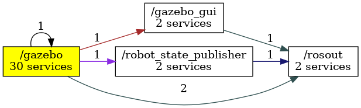

<!--
File was automatically generated using 'ros-diagram-tools' project.
Project is distributed under the BSD 3-Clause license.
-->

## Main graph

| ROS nodes (4): | Package: | Description: |
| --------------------------------- | -------- | ------------ |
| [`/gazebo`](nodes/n__gazebo.html) | gazebo_ros | Gazebo node |
| [`/gazebo_gui`](nodes/n__gazebo_gui.html) | gazebo_ros |  |
| [`/robot_state_publisher`](nodes/n__robot_state_publisher.html) | nexus_4wd_mecanum_description |  |
| [`/rosout`](nodes/n__rosout.html) |  |  |

| ROS topics (15): | Description: |
| ----------------------------------- | ------------ |
| [`/clock`](nodes/t__clock.html) |  |
| [`/cmd_vel`](nodes/t__cmd_vel.html) |  |
| [`/gazebo/link_states`](nodes/t__gazebo_link_states.html) |  |
| [`/gazebo/model_states`](nodes/t__gazebo_model_states.html) |  |
| [`/gazebo/parameter_descriptions`](nodes/t__gazebo_parameter_descriptions.html) |  |
| [`/gazebo/parameter_updates`](nodes/t__gazebo_parameter_updates.html) |  |
| [`/gazebo/performance_metrics`](nodes/t__gazebo_performance_metrics.html) |  |
| [`/gazebo/set_link_state`](nodes/t__gazebo_set_link_state.html) |  |
| [`/gazebo/set_model_state`](nodes/t__gazebo_set_model_state.html) |  |
| [`/joint_states`](nodes/t__joint_states.html) |  |
| [`/odom`](nodes/t__odom.html) | topic with odometry |
| [`/rosout`](nodes/t__rosout.html) |  |
| [`/rosout_agg`](nodes/t__rosout_agg.html) |  |
| [`/tf`](nodes/t__tf.html) |  |
| [`/tf_static`](nodes/t__tf_static.html) |  |

| ROS services (36): | Description: |
| ----------------------------------- | ------------ |
| [`/gazebo/apply_body_wrench`](nodes/s__gazebo_apply_body_wrench.html) |  |
| [`/gazebo/apply_joint_effort`](nodes/s__gazebo_apply_joint_effort.html) |  |
| [`/gazebo/clear_body_wrenches`](nodes/s__gazebo_clear_body_wrenches.html) |  |
| [`/gazebo/clear_joint_forces`](nodes/s__gazebo_clear_joint_forces.html) |  |
| [`/gazebo/delete_light`](nodes/s__gazebo_delete_light.html) |  |
| [`/gazebo/delete_model`](nodes/s__gazebo_delete_model.html) |  |
| [`/gazebo/get_joint_properties`](nodes/s__gazebo_get_joint_properties.html) |  |
| [`/gazebo/get_light_properties`](nodes/s__gazebo_get_light_properties.html) |  |
| [`/gazebo/get_link_properties`](nodes/s__gazebo_get_link_properties.html) |  |
| [`/gazebo/get_link_state`](nodes/s__gazebo_get_link_state.html) |  |
| [`/gazebo/get_loggers`](nodes/s__gazebo_get_loggers.html) |  |
| [`/gazebo/get_model_properties`](nodes/s__gazebo_get_model_properties.html) |  |
| [`/gazebo/get_model_state`](nodes/s__gazebo_get_model_state.html) |  |
| [`/gazebo/get_physics_properties`](nodes/s__gazebo_get_physics_properties.html) |  |
| [`/gazebo/get_world_properties`](nodes/s__gazebo_get_world_properties.html) |  |
| [`/gazebo/pause_physics`](nodes/s__gazebo_pause_physics.html) |  |
| [`/gazebo/reset_simulation`](nodes/s__gazebo_reset_simulation.html) |  |
| [`/gazebo/reset_world`](nodes/s__gazebo_reset_world.html) |  |
| [`/gazebo/set_joint_properties`](nodes/s__gazebo_set_joint_properties.html) |  |
| [`/gazebo/set_light_properties`](nodes/s__gazebo_set_light_properties.html) |  |
| [`/gazebo/set_link_properties`](nodes/s__gazebo_set_link_properties.html) |  |
| [`/gazebo/set_link_state`](nodes/s__gazebo_set_link_state.html) |  |
| [`/gazebo/set_logger_level`](nodes/s__gazebo_set_logger_level.html) |  |
| [`/gazebo/set_model_configuration`](nodes/s__gazebo_set_model_configuration.html) |  |
| [`/gazebo/set_model_state`](nodes/s__gazebo_set_model_state.html) |  |
| [`/gazebo/set_parameters`](nodes/s__gazebo_set_parameters.html) |  |
| [`/gazebo/set_physics_properties`](nodes/s__gazebo_set_physics_properties.html) |  |
| [`/gazebo/spawn_sdf_model`](nodes/s__gazebo_spawn_sdf_model.html) |  |
| [`/gazebo/spawn_urdf_model`](nodes/s__gazebo_spawn_urdf_model.html) |  |
| [`/gazebo/unpause_physics`](nodes/s__gazebo_unpause_physics.html) |  |
| [`/gazebo_gui/get_loggers`](nodes/s__gazebo_gui_get_loggers.html) |  |
| [`/gazebo_gui/set_logger_level`](nodes/s__gazebo_gui_set_logger_level.html) |  |
| [`/robot_state_publisher/get_loggers`](nodes/s__robot_state_publisher_get_loggers.html) |  |
| [`/robot_state_publisher/set_logger_level`](nodes/s__robot_state_publisher_set_logger_level.html) |  |
| [`/rosout/get_loggers`](nodes/s__rosout_get_loggers.html) | returns ROS loggers |
| [`/rosout/set_logger_level`](nodes/s__rosout_set_logger_level.html) |  |

    File was automatically generated using [*ros-diagram-tools*]("https://github.com/anetczuk/ros-diagram-tools") project.
    Project is distributed under the BSD 3-Clause license.

