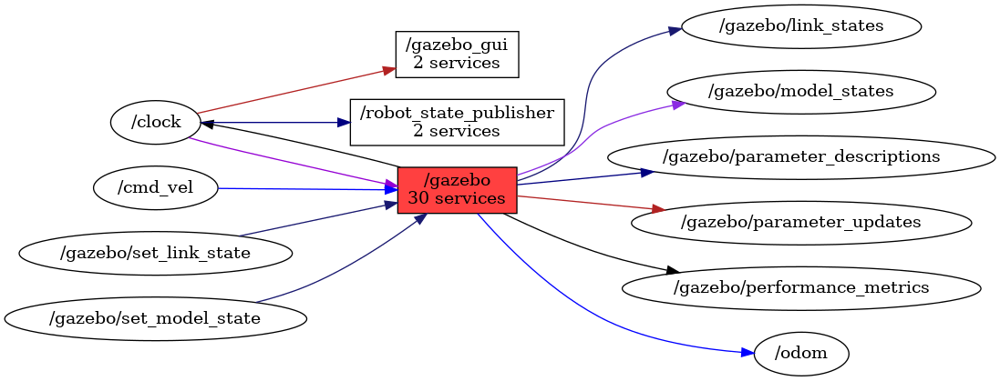

<!--
File was automatically generated using 'ros-diagram-tools' project.
Project is distributed under the BSD 3-Clause license.
-->

## Node

                
| ROS nodes (4): | Description: |
| ----------------------------------- | ------------ |
| [`/gazebo`](n__gazebo.html) | Gazebo node |
| [`/gazebo_gui`](n__gazebo_gui.html) |  |
| [`/robot_state_publisher`](n__robot_state_publisher.html) |  |
| [`/rosout`](n__rosout.html) |  |

| ROS topics (11): | Description: |
| ----------------------------------- | ------------ |
| [`/clock`](t__clock.html) |  |
| [`/cmd_vel`](t__cmd_vel.html) |  |
| [`/gazebo/link_states`](t__gazebo_link_states.html) |  |
| [`/gazebo/model_states`](t__gazebo_model_states.html) |  |
| [`/gazebo/parameter_descriptions`](t__gazebo_parameter_descriptions.html) |  |
| [`/gazebo/parameter_updates`](t__gazebo_parameter_updates.html) |  |
| [`/gazebo/performance_metrics`](t__gazebo_performance_metrics.html) |  |
| [`/gazebo/set_link_state`](t__gazebo_set_link_state.html) |  |
| [`/gazebo/set_model_state`](t__gazebo_set_model_state.html) |  |
| [`/odom`](t__odom.html) | topic with odometry |
| [`/rosout`](t__rosout.html) |  |

| ROS services (30): | Description: |
| ----------------------------------- | ------------ |
| [`/gazebo/apply_body_wrench`](s__gazebo_apply_body_wrench.html) |  |
| [`/gazebo/apply_joint_effort`](s__gazebo_apply_joint_effort.html) |  |
| [`/gazebo/clear_body_wrenches`](s__gazebo_clear_body_wrenches.html) |  |
| [`/gazebo/clear_joint_forces`](s__gazebo_clear_joint_forces.html) |  |
| [`/gazebo/delete_light`](s__gazebo_delete_light.html) |  |
| [`/gazebo/delete_model`](s__gazebo_delete_model.html) |  |
| [`/gazebo/get_joint_properties`](s__gazebo_get_joint_properties.html) |  |
| [`/gazebo/get_light_properties`](s__gazebo_get_light_properties.html) |  |
| [`/gazebo/get_link_properties`](s__gazebo_get_link_properties.html) |  |
| [`/gazebo/get_link_state`](s__gazebo_get_link_state.html) |  |
| [`/gazebo/get_loggers`](s__gazebo_get_loggers.html) |  |
| [`/gazebo/get_model_properties`](s__gazebo_get_model_properties.html) |  |
| [`/gazebo/get_model_state`](s__gazebo_get_model_state.html) |  |
| [`/gazebo/get_physics_properties`](s__gazebo_get_physics_properties.html) |  |
| [`/gazebo/get_world_properties`](s__gazebo_get_world_properties.html) |  |
| [`/gazebo/pause_physics`](s__gazebo_pause_physics.html) |  |
| [`/gazebo/reset_simulation`](s__gazebo_reset_simulation.html) |  |
| [`/gazebo/reset_world`](s__gazebo_reset_world.html) |  |
| [`/gazebo/set_joint_properties`](s__gazebo_set_joint_properties.html) |  |
| [`/gazebo/set_light_properties`](s__gazebo_set_light_properties.html) |  |
| [`/gazebo/set_link_properties`](s__gazebo_set_link_properties.html) |  |
| [`/gazebo/set_link_state`](s__gazebo_set_link_state.html) |  |
| [`/gazebo/set_logger_level`](s__gazebo_set_logger_level.html) |  |
| [`/gazebo/set_model_configuration`](s__gazebo_set_model_configuration.html) |  |
| [`/gazebo/set_model_state`](s__gazebo_set_model_state.html) |  |
| [`/gazebo/set_parameters`](s__gazebo_set_parameters.html) |  |
| [`/gazebo/set_physics_properties`](s__gazebo_set_physics_properties.html) |  |
| [`/gazebo/spawn_sdf_model`](s__gazebo_spawn_sdf_model.html) |  |
| [`/gazebo/spawn_urdf_model`](s__gazebo_spawn_urdf_model.html) |  |
| [`/gazebo/unpause_physics`](s__gazebo_unpause_physics.html) |  |

 

File was automatically generated using <a href="https://github.com/anetczuk/ros-diagram-tools"><i>ros-diagram-tools</i></a> project.
Project is distributed under the BSD 3-Clause license.

