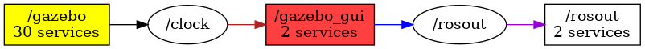

<!--
File was automatically generated using 'ros-diagram-tools' project.
Project is distributed under the BSD 3-Clause license.
-->

## Node

|     |     |
| --- | --- |
| Package name: | `gazebo_ros` |
| Package path: | `/opt/ros/noetic/share/gazebo_ros` |

| ROS nodes (3): | Description: |
| -------------- | ------------ |
| [`/gazebo`](n__gazebo.md) | Gazebo node |
| [`/gazebo_gui`](n__gazebo_gui.md) |  |
| [`/rosout`](n__rosout.md) |  |

| ROS topics (2): | Description: |
| --------------- | ------------ |
| [`/clock`](t__clock.md) |  |
| [`/rosout`](t__rosout.md) |  |

| ROS services (2): | Description: |
| ----------------- | ------------ |
| [`/gazebo_gui/get_loggers`](s__gazebo_gui_get_loggers.md) |  |
| [`/gazebo_gui/set_logger_level`](s__gazebo_gui_set_logger_level.md) |  |

 

File was automatically generated using <a href="https://github.com/anetczuk/ros-diagram-tools"><i>ros-diagram-tools</i></a> project.
Project is distributed under the BSD 3-Clause license.

