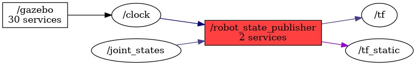

<!--
File was automatically generated using 'ros-diagram-tools' project.
Project is distributed under the BSD 3-Clause license.
-->

## Node

|     |     |
| --- | --- |
| Package name: | `nexus_4wd_mecanum_description` |
| Package path: | `/home/vbox/rosdiagrams/mecanum/catkin_ws/src/nexus_4wd_mecanum_description` |

| ROS nodes (3): | Description: |
| -------------- | ------------ |
| [`/gazebo`](n__gazebo.html) | Gazebo node |
| [`/robot_state_publisher`](n__robot_state_publisher.html) |  |
| [`/rosout`](n__rosout.html) |  |

| ROS topics (5): | Description: |
| --------------- | ------------ |
| [`/clock`](t__clock.html) |  |
| [`/joint_states`](t__joint_states.html) |  |
| [`/rosout`](t__rosout.html) |  |
| [`/tf`](t__tf.html) |  |
| [`/tf_static`](t__tf_static.html) |  |

| ROS services (2): | Description: |
| ----------------- | ------------ |
| [`/robot_state_publisher/get_loggers`](s__robot_state_publisher_get_loggers.html) |  |
| [`/robot_state_publisher/set_logger_level`](s__robot_state_publisher_set_logger_level.html) |  |

 

File was automatically generated using <a href="https://github.com/anetczuk/ros-diagram-tools"><i>ros-diagram-tools</i></a> project.
Project is distributed under the BSD 3-Clause license.

