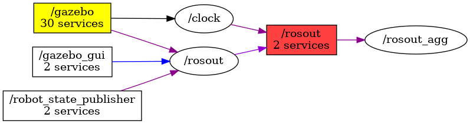

<!--
File was automatically generated using 'ros-diagram-tools' project.
Project is distributed under the BSD 3-Clause license.
-->

## Node

| ROS nodes (4): | Description: |
| -------------- | ------------ |
| [`/gazebo`](n__gazebo.md) | Gazebo node |
| [`/gazebo_gui`](n__gazebo_gui.md) |  |
| [`/robot_state_publisher`](n__robot_state_publisher.md) |  |
| [`/rosout`](n__rosout.md) |  |

| ROS topics (3): | Description: |
| --------------- | ------------ |
| [`/clock`](t__clock.md) |  |
| [`/rosout`](t__rosout.md) |  |
| [`/rosout_agg`](t__rosout_agg.md) |  |

| ROS services (2): | Description: |
| ----------------- | ------------ |
| [`/rosout/get_loggers`](s__rosout_get_loggers.md) | returns ROS loggers |
| [`/rosout/set_logger_level`](s__rosout_set_logger_level.md) |  |

 

File was automatically generated using <a href="https://github.com/anetczuk/ros-diagram-tools"><i>ros-diagram-tools</i></a> project.
Project is distributed under the BSD 3-Clause license.

