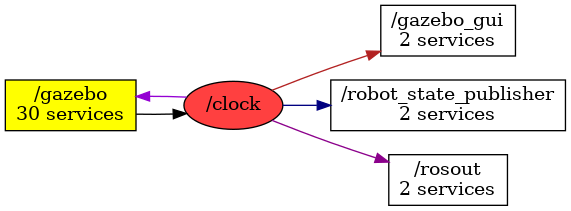

<!--
File was automatically generated using 'ros-diagram-tools' project.
Project is distributed under the BSD 3-Clause license.
-->

## Topic

[](t__clock.png)

|     |     |
| --- | --- |
| Topic name: | `/clock` |
| Data type: | `rosgraph_msgs/Clock` |
| Publishers: | `/gazebo` |
| Subscribers: | `/robot_state_publisher /gazebo /gazebo_gui` |

Message:
```
time clock

```


| ROS nodes (4): | Description: |
| -------------- | ------------ |
| [`/gazebo`](n__gazebo.md) | Gazebo node |
| [`/gazebo_gui`](n__gazebo_gui.md) |  |
| [`/robot_state_publisher`](n__robot_state_publisher.md) |  |
| [`/rosout`](n__rosout.md) |  |

| ROS topics (1): | Description: |
| --------------- | ------------ |
| [`/clock`](t__clock.md) |  |


</br>
<font size="1">
File was automatically generated using <a href="https://github.com/anetczuk/ros-diagram-tools"><i>ros-diagram-tools</i></a> project.
Project is distributed under the BSD 3-Clause license.
</font>
