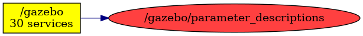

<!--
File was automatically generated using 'ros-diagram-tools' project.
Project is distributed under the BSD 3-Clause license.
-->

## Topic

[](t__gazebo_parameter_descriptions.png)

|     |     |
| --- | --- |
| Topic name: | `/gazebo/parameter_descriptions` |
| Data type: | `dynamic_reconfigure/ConfigDescription` |
| Publishers: | `/gazebo` |
| Subscribers: | `` |

Message:
```
dynamic_reconfigure/Group[] groups
  string name
  string type
  dynamic_reconfigure/ParamDescription[] parameters
    string name
    string type
    uint32 level
    string description
    string edit_method
  int32 parent
  int32 id
dynamic_reconfigure/Config max
  dynamic_reconfigure/BoolParameter[] bools
    string name
    bool value
  dynamic_reconfigure/IntParameter[] ints
    string name
    int32 value
  dynamic_reconfigure/StrParameter[] strs
    string name
    string value
  dynamic_reconfigure/DoubleParameter[] doubles
    string name
    float64 value
  dynamic_reconfigure/GroupState[] groups
    string name
    bool state
    int32 id
    int32 parent
dynamic_reconfigure/Config min
  dynamic_reconfigure/BoolParameter[] bools
    string name
    bool value
  dynamic_reconfigure/IntParameter[] ints
    string name
    int32 value
  dynamic_reconfigure/StrParameter[] strs
    string name
    string value
  dynamic_reconfigure/DoubleParameter[] doubles
    string name
    float64 value
  dynamic_reconfigure/GroupState[] groups
    string name
    bool state
    int32 id
    int32 parent
dynamic_reconfigure/Config dflt
  dynamic_reconfigure/BoolParameter[] bools
    string name
    bool value
  dynamic_reconfigure/IntParameter[] ints
    string name
    int32 value
  dynamic_reconfigure/StrParameter[] strs
    string name
    string value
  dynamic_reconfigure/DoubleParameter[] doubles
    string name
    float64 value
  dynamic_reconfigure/GroupState[] groups
    string name
    bool state
    int32 id
    int32 parent


```


| ROS nodes (1): | Description: |
| -------------- | ------------ |
| [`/gazebo`](n__gazebo.html) | Gazebo node |

| ROS topics (1): | Description: |
| --------------- | ------------ |
| [`/gazebo/parameter_descriptions`](t__gazebo_parameter_descriptions.html) |  |


</br>
<font size="1">
File was automatically generated using <a href="https://github.com/anetczuk/ros-diagram-tools"><i>ros-diagram-tools</i></a> project.
Project is distributed under the BSD 3-Clause license.
</font>
