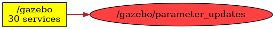

<!--
File was automatically generated using 'ros-diagram-tools' project.
Project is distributed under the BSD 3-Clause license.
-->

## Topic

[](t__gazebo_parameter_updates.png)

|     |     |
| --- | --- |
| Topic name: | `/gazebo/parameter_updates` |
| Data type: | `dynamic_reconfigure/Config` |
| Publishers: | `/gazebo` |
| Subscribers: | `` |

Message:
```
dynamic_reconfigure/BoolParameter[] bools
  string name
  bool value
dynamic_reconfigure/IntParameter[] ints
  string name
  int32 value
dynamic_reconfigure/StrParameter[] strs
  string name
  string value
dynamic_reconfigure/DoubleParameter[] doubles
  string name
  float64 value
dynamic_reconfigure/GroupState[] groups
  string name
  bool state
  int32 id
  int32 parent


```


| ROS nodes (1): | Description: |
| -------------- | ------------ |
| [`/gazebo`](n__gazebo.html) | Gazebo node |

| ROS topics (1): | Description: |
| --------------- | ------------ |
| [`/gazebo/parameter_updates`](t__gazebo_parameter_updates.html) |  |


</br>
<font size="1">
File was automatically generated using <a href="https://github.com/anetczuk/ros-diagram-tools"><i>ros-diagram-tools</i></a> project.
Project is distributed under the BSD 3-Clause license.
</font>
