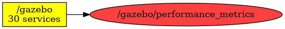

<!--
File was automatically generated using 'ros-diagram-tools' project.
Project is distributed under the BSD 3-Clause license.
-->

## Topic

[](t__gazebo_performance_metrics.png)

|     |     |
| --- | --- |
| Topic name: | `/gazebo/performance_metrics` |
| Data type: | `gazebo_msgs/PerformanceMetrics` |
| Publishers: | `/gazebo` |
| Subscribers: | `` |

Message:
```
std_msgs/Header header
  uint32 seq
  time stamp
  string frame_id
float64 real_time_factor
gazebo_msgs/SensorPerformanceMetric[] sensors
  string name
  float64 sim_update_rate
  float64 real_update_rate
  float64 fps

```


| ROS nodes (1): | Description: |
| -------------- | ------------ |
| [`/gazebo`](n__gazebo.md) | Gazebo node |

| ROS topics (1): | Description: |
| --------------- | ------------ |
| [`/gazebo/performance_metrics`](t__gazebo_performance_metrics.md) |  |


</br>
<font size="1">
File was automatically generated using <a href="https://github.com/anetczuk/ros-diagram-tools"><i>ros-diagram-tools</i></a> project.
Project is distributed under the BSD 3-Clause license.
</font>
