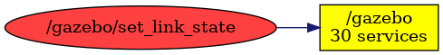

<!--
File was automatically generated using 'ros-diagram-tools' project.
Project is distributed under the BSD 3-Clause license.
-->

## Topic

[](t__gazebo_set_link_state.png)

|     |     |
| --- | --- |
| Topic name: | `/gazebo/set_link_state` |
| Data type: | `gazebo_msgs/LinkState` |
| Publishers: | `` |
| Subscribers: | `/gazebo` |

Message:
```
string link_name
geometry_msgs/Pose pose
  geometry_msgs/Point position
    float64 x
    float64 y
    float64 z
  geometry_msgs/Quaternion orientation
    float64 x
    float64 y
    float64 z
    float64 w
geometry_msgs/Twist twist
  geometry_msgs/Vector3 linear
    float64 x
    float64 y
    float64 z
  geometry_msgs/Vector3 angular
    float64 x
    float64 y
    float64 z
string reference_frame

```


| ROS nodes (1): | Description: |
| -------------- | ------------ |
| [`/gazebo`](n__gazebo.md) | Gazebo node |

| ROS topics (1): | Description: |
| --------------- | ------------ |
| [`/gazebo/set_link_state`](t__gazebo_set_link_state.md) |  |


</br>
<font size="1">
File was automatically generated using <a href="https://github.com/anetczuk/ros-diagram-tools"><i>ros-diagram-tools</i></a> project.
Project is distributed under the BSD 3-Clause license.
</font>
