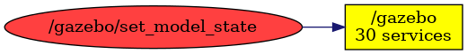

<!--
File was automatically generated using 'ros-diagram-tools' project.
Project is distributed under the BSD 3-Clause license.
-->

## Topic

[](t__gazebo_set_model_state.png)

|  |  |
| --------------------------------- | -------- | ------------ |
| Topic name: | `/gazebo/set_model_state` |
| Data type | `gazebo_msgs/ModelState` |
| Publishers: | `` |
| Subscribers: | `/gazebo` |

Message:
```
string model_name
geometry_msgs/Pose pose
  geometry_msgs/Point position
    float64 x
    float64 y
    float64 z
  geometry_msgs/Quaternion orientation
    float64 x
    float64 y
    float64 z
    float64 w
geometry_msgs/Twist twist
  geometry_msgs/Vector3 linear
    float64 x
    float64 y
    float64 z
  geometry_msgs/Vector3 angular
    float64 x
    float64 y
    float64 z
string reference_frame


```


| ROS nodes (1): | Description: |
| ----------------------------------- | ------------ |
| [`/gazebo`](n__gazebo.html) | Gazebo node |

| ROS topics (1): | Description: |
| ----------------------------------- | ------------ |
| [`/gazebo/set_model_state`](t__gazebo_set_model_state.html) |  |


</br>
File was automatically generated using [*ros-diagram-tools*](https://github.com/anetczuk/ros-diagram-tools) project.
Project is distributed under the BSD 3-Clause license.
