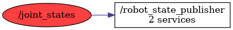

<!--
File was automatically generated using 'ros-diagram-tools' project.
Project is distributed under the BSD 3-Clause license.
-->

## Topic

[](t__joint_states.png)

|     |     |
| --- | --- |
| Topic name: | `/joint_states` |
| Data type: | `sensor_msgs/JointState` |
| Publishers: | `` |
| Subscribers: | `/robot_state_publisher` |

Message:
```
std_msgs/Header header
  uint32 seq
  time stamp
  string frame_id
string[] name
float64[] position
float64[] velocity
float64[] effort


```


| ROS nodes (1): | Description: |
| -------------- | ------------ |
| [`/robot_state_publisher`](n__robot_state_publisher.md) |  |

| ROS topics (1): | Description: |
| --------------- | ------------ |
| [`/joint_states`](t__joint_states.md) |  |


</br>
<font size="1">
File was automatically generated using <a href="https://github.com/anetczuk/ros-diagram-tools"><i>ros-diagram-tools</i></a> project.
Project is distributed under the BSD 3-Clause license.
</font>
