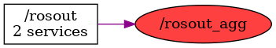

<!--
File was automatically generated using 'ros-diagram-tools' project.
Project is distributed under the BSD 3-Clause license.
-->

## Topic

[](t__rosout_agg.png)

|  |  |
| --------------------------------- | -------- | ------------ |
| Topic name: | `/rosout_agg` |
| Data type | `rosgraph_msgs/Log` |
| Publishers: | `` |
| Subscribers: | `` |

Message:
```
byte DEBUG=1
byte INFO=2
byte WARN=4
byte ERROR=8
byte FATAL=16
std_msgs/Header header
  uint32 seq
  time stamp
  string frame_id
byte level
string name
string msg
string file
string function
uint32 line
string[] topics


```


| ROS nodes (1): | Description: |
| ----------------------------------- | ------------ |
| [`/rosout`](n__rosout.html) |  |

| ROS topics (1): | Description: |
| ----------------------------------- | ------------ |
| [`/rosout_agg`](t__rosout_agg.html) |  |


</br>
<font size="1">
File was automatically generated using <a href="https://github.com/anetczuk/ros-diagram-tools"><i>ros-diagram-tools</i></a> project.
Project is distributed under the BSD 3-Clause license.
</font>
