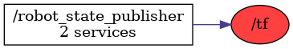

<!--
File was automatically generated using 'ros-diagram-tools' project.
Project is distributed under the BSD 3-Clause license.
-->

## Topic

[](t__tf.png)

|     |     |
| --- | --- |
| Topic name: | `/tf` |
| Data type: | `tf2_msgs/TFMessage` |
| Publishers: | `/robot_state_publisher` |
| Subscribers: | `` |

Message:
```
geometry_msgs/TransformStamped[] transforms
  std_msgs/Header header
    uint32 seq
    time stamp
    string frame_id
  string child_frame_id
  geometry_msgs/Transform transform
    geometry_msgs/Vector3 translation
      float64 x
      float64 y
      float64 z
    geometry_msgs/Quaternion rotation
      float64 x
      float64 y
      float64 z
      float64 w


```


| ROS nodes (1): | Description: |
| -------------- | ------------ |
| [`/robot_state_publisher`](n__robot_state_publisher.html) |  |

| ROS topics (1): | Description: |
| --------------- | ------------ |
| [`/tf`](t__tf.html) |  |


</br>
<font size="1">
File was automatically generated using <a href="https://github.com/anetczuk/ros-diagram-tools"><i>ros-diagram-tools</i></a> project.
Project is distributed under the BSD 3-Clause license.
</font>
