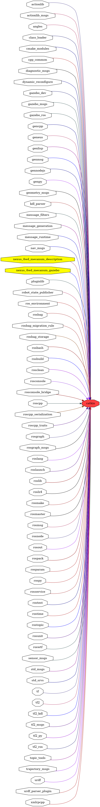

<!--
File was automatically generated using 'ros-diagram-tools' project.
Project is distributed under the BSD 3-Clause license.
-->

## packages graph

|     |     |
| --- | --- |
| Package path: | `/opt/ros/noetic/share/catkin` |
| Nodes: | `` |

| Graph packages (74): | Description: |
| -------------------- | ------------ |
| [`actionlib`](actionlib.md) |  |
| [`actionlib_msgs`](actionlib_msgs.md) |  |
| [`angles`](angles.md) |  |
| [`catkin`](catkin.md) |  |
| [`class_loader`](class_loader.md) |  |
| [`cmake_modules`](cmake_modules.md) |  |
| [`cpp_common`](cpp_common.md) |  |
| [`diagnostic_msgs`](diagnostic_msgs.md) |  |
| [`dynamic_reconfigure`](dynamic_reconfigure.md) |  |
| [`gazebo_dev`](gazebo_dev.md) | Gazebo package |
| [`gazebo_msgs`](gazebo_msgs.md) | Gazebo package |
| [`gazebo_ros`](gazebo_ros.md) | Gazebo package |
| [`gencpp`](gencpp.md) |  |
| [`geneus`](geneus.md) |  |
| [`genlisp`](genlisp.md) |  |
| [`genmsg`](genmsg.md) |  |
| [`gennodejs`](gennodejs.md) |  |
| [`genpy`](genpy.md) |  |
| [`geometry_msgs`](geometry_msgs.md) |  |
| [`kdl_parser`](kdl_parser.md) |  |
| [`message_filters`](message_filters.md) |  |
| [`message_generation`](message_generation.md) |  |
| [`message_runtime`](message_runtime.md) |  |
| [`nav_msgs`](nav_msgs.md) |  |
| [`nexus_4wd_mecanum_description`](nexus_4wd_mecanum_description.md) |  |
| [`nexus_4wd_mecanum_gazebo`](nexus_4wd_mecanum_gazebo.md) |  |
| [`pluginlib`](pluginlib.md) |  |
| [`robot_state_publisher`](robot_state_publisher.md) |  |
| [`ros_environment`](ros_environment.md) |  |
| [`rosbag`](rosbag.md) |  |
| [`rosbag_migration_rule`](rosbag_migration_rule.md) |  |
| [`rosbag_storage`](rosbag_storage.md) |  |
| [`rosbash`](rosbash.md) |  |
| [`rosbuild`](rosbuild.md) |  |
| [`rosclean`](rosclean.md) |  |
| [`rosconsole`](rosconsole.md) |  |
| [`rosconsole_bridge`](rosconsole_bridge.md) |  |
| [`roscpp`](roscpp.md) |  |
| [`roscpp_serialization`](roscpp_serialization.md) |  |
| [`roscpp_traits`](roscpp_traits.md) |  |
| [`rosgraph`](rosgraph.md) |  |
| [`rosgraph_msgs`](rosgraph_msgs.md) |  |
| [`roslang`](roslang.md) |  |
| [`roslaunch`](roslaunch.md) |  |
| [`roslib`](roslib.md) |  |
| [`roslz4`](roslz4.md) |  |
| [`rosmake`](rosmake.md) |  |
| [`rosmaster`](rosmaster.md) |  |
| [`rosmsg`](rosmsg.md) |  |
| [`rosnode`](rosnode.md) |  |
| [`rosout`](rosout.md) |  |
| [`rospack`](rospack.md) |  |
| [`rosparam`](rosparam.md) |  |
| [`rospy`](rospy.md) |  |
| [`rosservice`](rosservice.md) |  |
| [`rostest`](rostest.md) |  |
| [`rostime`](rostime.md) |  |
| [`rostopic`](rostopic.md) |  |
| [`rosunit`](rosunit.md) |  |
| [`roswtf`](roswtf.md) |  |
| [`sensor_msgs`](sensor_msgs.md) |  |
| [`std_msgs`](std_msgs.md) |  |
| [`std_srvs`](std_srvs.md) |  |
| [`tf`](tf.md) |  |
| [`tf2`](tf2.md) |  |
| [`tf2_kdl`](tf2_kdl.md) |  |
| [`tf2_msgs`](tf2_msgs.md) |  |
| [`tf2_py`](tf2_py.md) |  |
| [`tf2_ros`](tf2_ros.md) |  |
| [`topic_tools`](topic_tools.md) |  |
| [`trajectory_msgs`](trajectory_msgs.md) |  |
| [`urdf`](urdf.md) |  |
| [`urdf_parser_plugin`](urdf_parser_plugin.md) |  |
| [`xmlrpcpp`](xmlrpcpp.md) |  |

 

File was automatically generated using <a href="https://github.com/anetczuk/ros-diagram-tools"><i>ros-diagram-tools</i></a> project.
Project is distributed under the BSD 3-Clause license.

