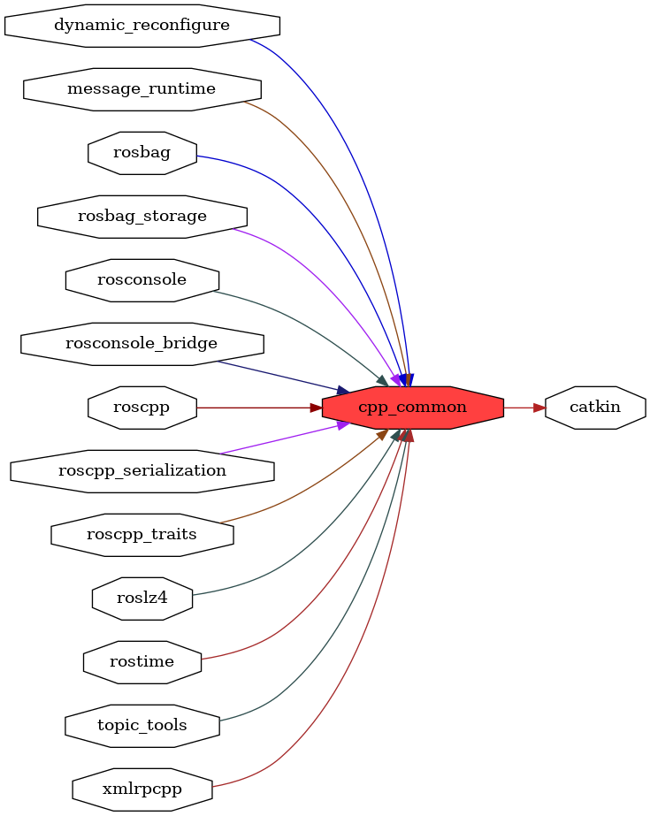

<!--
File was automatically generated using 'ros-diagram-tools' project.
Project is distributed under the BSD 3-Clause license.
-->

## packages graph

|     |     |
| --- | --- |
| Package path: | `/opt/ros/noetic/share/cpp_common` |
| Nodes: | `` |

| Graph packages (15): | Description: |
| -------------------- | ------------ |
| [`catkin`](catkin.md) |  |
| [`cpp_common`](cpp_common.md) |  |
| [`dynamic_reconfigure`](dynamic_reconfigure.md) |  |
| [`message_runtime`](message_runtime.md) |  |
| [`rosbag`](rosbag.md) |  |
| [`rosbag_storage`](rosbag_storage.md) |  |
| [`rosconsole`](rosconsole.md) |  |
| [`rosconsole_bridge`](rosconsole_bridge.md) |  |
| [`roscpp`](roscpp.md) |  |
| [`roscpp_serialization`](roscpp_serialization.md) |  |
| [`roscpp_traits`](roscpp_traits.md) |  |
| [`roslz4`](roslz4.md) |  |
| [`rostime`](rostime.md) |  |
| [`topic_tools`](topic_tools.md) |  |
| [`xmlrpcpp`](xmlrpcpp.md) |  |

 

File was automatically generated using <a href="https://github.com/anetczuk/ros-diagram-tools"><i>ros-diagram-tools</i></a> project.
Project is distributed under the BSD 3-Clause license.

