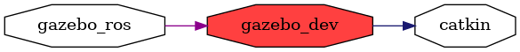

<!--
File was automatically generated using 'ros-diagram-tools' project.
Project is distributed under the BSD 3-Clause license.
-->

## packages graph

|     |     |
| --- | --- |
| Package path: | `/opt/ros/noetic/share/gazebo_dev` |
| Nodes: | `` |
| Graph packages (2): | Description: |
| ----------------------------------- | ------------ |
| [`gazebo_dev`](gazebo_dev.html) | Gazebo package |
| [`gazebo_ros`](gazebo_ros.html) | Gazebo package |

 
File was automatically generated using [*ros-diagram-tools*](https://github.com/anetczuk/ros-diagram-tools) project.
Project is distributed under the BSD 3-Clause license.
