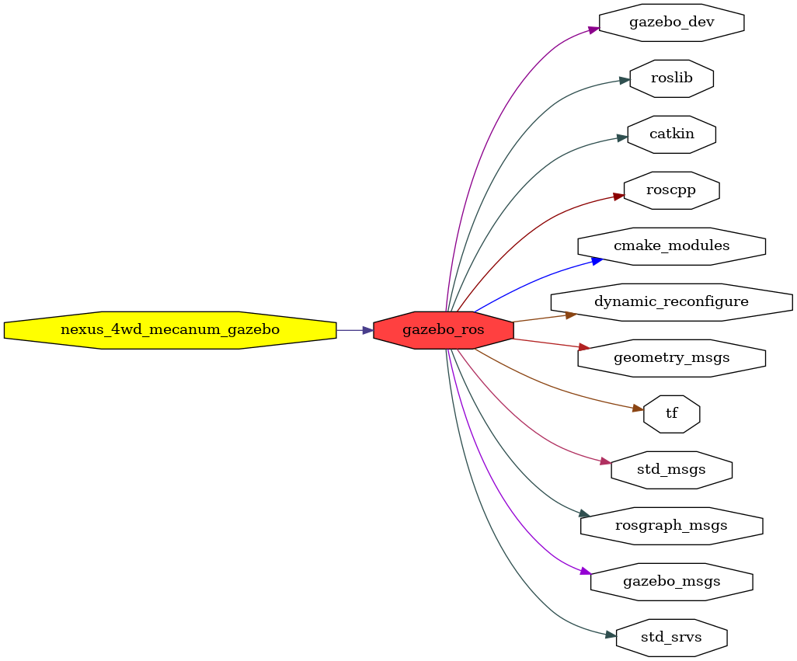

<!--
File was automatically generated using 'ros-diagram-tools' project.
Project is distributed under the BSD 3-Clause license.
-->

## packages graph

|     |     |
| --- | --- |
| Package path: | `/opt/ros/noetic/share/gazebo_ros` |
| Nodes: | `/gazebo /gazebo_gui` |
| Graph packages (12): | Description: |
| ----------------------------------- | ------------ |
| [`dynamic_reconfigure`](dynamic_reconfigure.html) |  |
| [`gazebo_dev`](gazebo_dev.html) | Gazebo package |
| [`gazebo_msgs`](gazebo_msgs.html) | Gazebo package |
| [`gazebo_ros`](gazebo_ros.html) | Gazebo package |
| [`geometry_msgs`](geometry_msgs.html) |  |
| [`nexus_4wd_mecanum_gazebo`](nexus_4wd_mecanum_gazebo.html) |  |
| [`roscpp`](roscpp.html) |  |
| [`rosgraph_msgs`](rosgraph_msgs.html) |  |
| [`roslib`](roslib.html) |  |
| [`std_msgs`](std_msgs.html) |  |
| [`std_srvs`](std_srvs.html) |  |
| [`tf`](tf.html) |  |

 
File was automatically generated using [*ros-diagram-tools*](https://github.com/anetczuk/ros-diagram-tools) project.
Project is distributed under the BSD 3-Clause license.
