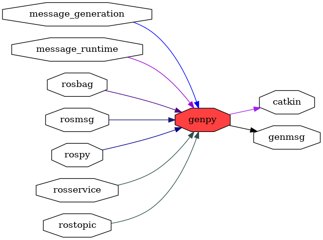

<!--
File was automatically generated using 'ros-diagram-tools' project.
Project is distributed under the BSD 3-Clause license.
-->

## packages graph

|     |     |
| --- | --- |
| Package path: | `/opt/ros/noetic/share/genpy` |
| Nodes: | `` |

| Graph packages (10): | Description: |
| -------------------- | ------------ |
| [`catkin`](catkin.md) |  |
| [`genmsg`](genmsg.md) |  |
| [`genpy`](genpy.md) |  |
| [`message_generation`](message_generation.md) |  |
| [`message_runtime`](message_runtime.md) |  |
| [`rosbag`](rosbag.md) |  |
| [`rosmsg`](rosmsg.md) |  |
| [`rospy`](rospy.md) |  |
| [`rosservice`](rosservice.md) |  |
| [`rostopic`](rostopic.md) |  |

 

File was automatically generated using <a href="https://github.com/anetczuk/ros-diagram-tools"><i>ros-diagram-tools</i></a> project.
Project is distributed under the BSD 3-Clause license.

