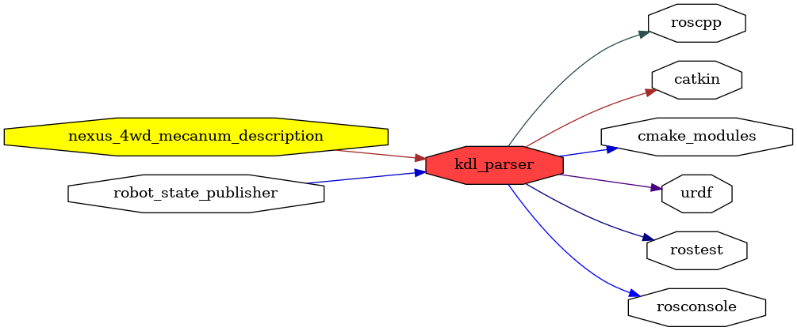

<!--
File was automatically generated using 'ros-diagram-tools' project.
Project is distributed under the BSD 3-Clause license.
-->

## packages graph

|     |     |
| --- | --- |
| Package path: | `/opt/ros/noetic/share/kdl_parser` |
| Nodes: | `` |

| Graph packages (5): | Description: |
| ------------------- | ------------ |
| [`kdl_parser`](kdl_parser.html) |  |
| [`nexus_4wd_mecanum_description`](nexus_4wd_mecanum_description.html) |  |
| [`robot_state_publisher`](robot_state_publisher.html) |  |
| [`rosconsole`](rosconsole.html) |  |
| [`urdf`](urdf.html) |  |

 

File was automatically generated using <a href="https://github.com/anetczuk/ros-diagram-tools"><i>ros-diagram-tools</i></a> project.
Project is distributed under the BSD 3-Clause license.

