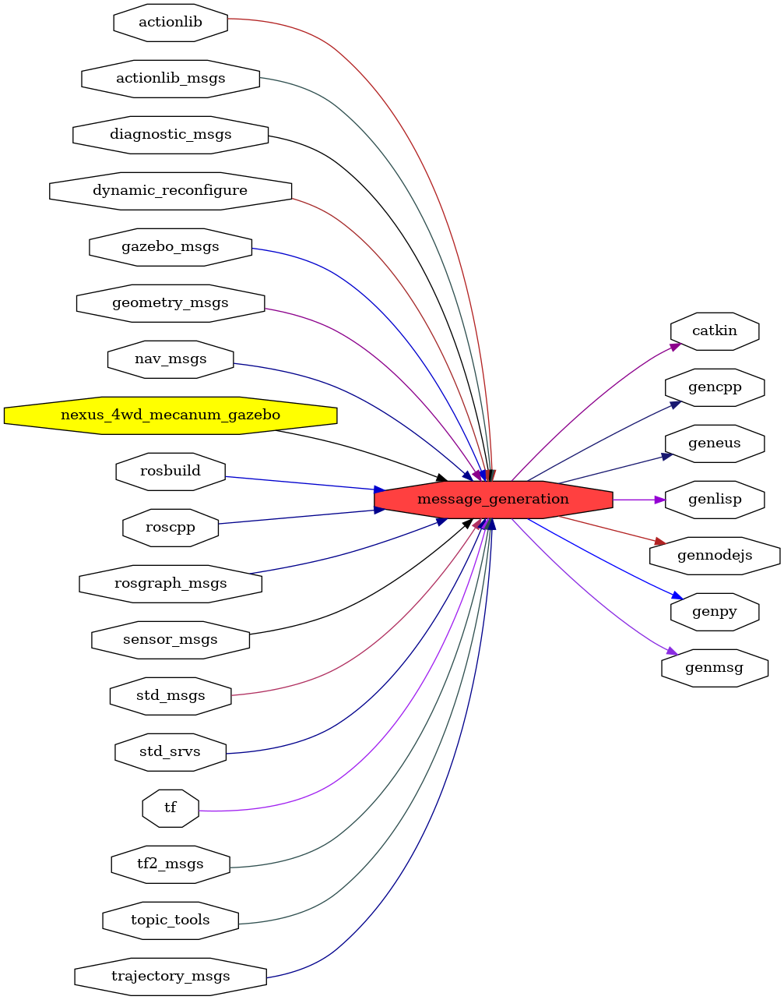

<!--
File was automatically generated using 'ros-diagram-tools' project.
Project is distributed under the BSD 3-Clause license.
-->

## packages graph

|     |     |
| --- | --- |
| Package path: | `/opt/ros/noetic/share/message_generation` |
| Nodes: | `` |

| Graph packages (26): | Description: |
| -------------------- | ------------ |
| [`actionlib`](actionlib.md) |  |
| [`actionlib_msgs`](actionlib_msgs.md) |  |
| [`catkin`](catkin.md) |  |
| [`diagnostic_msgs`](diagnostic_msgs.md) |  |
| [`dynamic_reconfigure`](dynamic_reconfigure.md) |  |
| [`gazebo_msgs`](gazebo_msgs.md) | Gazebo package |
| [`gencpp`](gencpp.md) |  |
| [`geneus`](geneus.md) |  |
| [`genlisp`](genlisp.md) |  |
| [`genmsg`](genmsg.md) |  |
| [`gennodejs`](gennodejs.md) |  |
| [`genpy`](genpy.md) |  |
| [`geometry_msgs`](geometry_msgs.md) |  |
| [`message_generation`](message_generation.md) |  |
| [`nav_msgs`](nav_msgs.md) |  |
| [`nexus_4wd_mecanum_gazebo`](nexus_4wd_mecanum_gazebo.md) |  |
| [`rosbuild`](rosbuild.md) |  |
| [`roscpp`](roscpp.md) |  |
| [`rosgraph_msgs`](rosgraph_msgs.md) |  |
| [`sensor_msgs`](sensor_msgs.md) |  |
| [`std_msgs`](std_msgs.md) |  |
| [`std_srvs`](std_srvs.md) |  |
| [`tf`](tf.md) |  |
| [`tf2_msgs`](tf2_msgs.md) |  |
| [`topic_tools`](topic_tools.md) |  |
| [`trajectory_msgs`](trajectory_msgs.md) |  |

 

File was automatically generated using <a href="https://github.com/anetczuk/ros-diagram-tools"><i>ros-diagram-tools</i></a> project.
Project is distributed under the BSD 3-Clause license.

