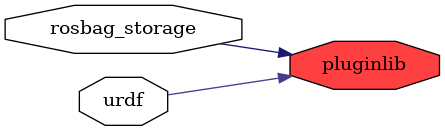

<!--
File was automatically generated using 'ros-diagram-tools' project.
Project is distributed under the BSD 3-Clause license.
-->

## packages graph

|     |     |
| --- | --- |
| Package path: | `/opt/ros/noetic/share/pluginlib` |
| Nodes: | `` |
| Graph packages (3): | Description: |
| ----------------------------------- | ------------ |
| [`pluginlib`](pluginlib.html) |  |
| [`rosbag_storage`](rosbag_storage.html) |  |
| [`urdf`](urdf.html) |  |

 
File was automatically generated using [*ros-diagram-tools*](https://github.com/anetczuk/ros-diagram-tools) project.
Project is distributed under the BSD 3-Clause license.
