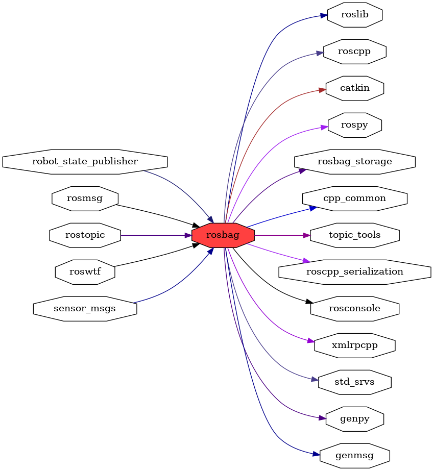

<!--
File was automatically generated using 'ros-diagram-tools' project.
Project is distributed under the BSD 3-Clause license.
-->

## packages graph

|     |     |
| --- | --- |
| Package path: | `/opt/ros/noetic/share/rosbag` |
| Nodes: | `` |
| Graph packages (13): | Description: |
| ----------------------------------- | ------------ |
| [`genmsg`](genmsg.html) |  |
| [`genpy`](genpy.html) |  |
| [`rosbag`](rosbag.html) |  |
| [`rosbag_storage`](rosbag_storage.html) |  |
| [`rosconsole`](rosconsole.html) |  |
| [`roscpp`](roscpp.html) |  |
| [`roslib`](roslib.html) |  |
| [`rosmsg`](rosmsg.html) |  |
| [`rospy`](rospy.html) |  |
| [`rostopic`](rostopic.html) |  |
| [`std_srvs`](std_srvs.html) |  |
| [`topic_tools`](topic_tools.html) |  |
| [`xmlrpcpp`](xmlrpcpp.html) |  |

 
File was automatically generated using [*ros-diagram-tools*](https://github.com/anetczuk/ros-diagram-tools) project.
Project is distributed under the BSD 3-Clause license.
