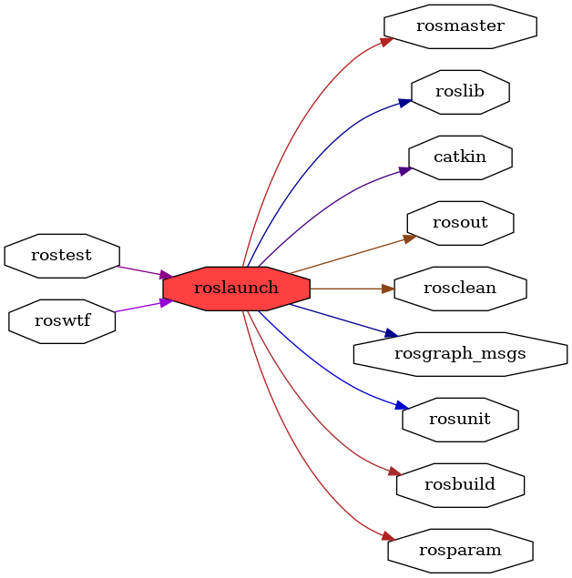

<!--
File was automatically generated using 'ros-diagram-tools' project.
Project is distributed under the BSD 3-Clause license.
-->

## packages graph

|     |     |
| --- | --- |
| Package path: | `/opt/ros/noetic/share/roslaunch` |
| Nodes: | `` |

| Graph packages (10): | Description: |
| -------------------- | ------------ |
| [`rosclean`](rosclean.md) |  |
| [`rosgraph_msgs`](rosgraph_msgs.md) |  |
| [`roslaunch`](roslaunch.md) |  |
| [`roslib`](roslib.md) |  |
| [`rosmaster`](rosmaster.md) |  |
| [`rosout`](rosout.md) |  |
| [`rosparam`](rosparam.md) |  |
| [`rostest`](rostest.md) |  |
| [`rosunit`](rosunit.md) |  |
| [`roswtf`](roswtf.md) |  |

 

File was automatically generated using <a href="https://github.com/anetczuk/ros-diagram-tools"><i>ros-diagram-tools</i></a> project.
Project is distributed under the BSD 3-Clause license.

