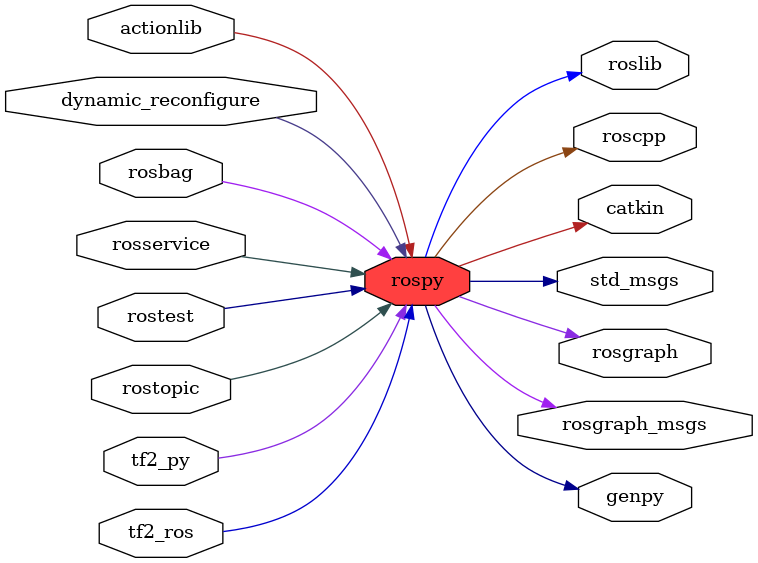

<!--
File was automatically generated using 'ros-diagram-tools' project.
Project is distributed under the BSD 3-Clause license.
-->

## packages graph

|     |     |
| --- | --- |
| Package path: | `/opt/ros/noetic/share/rospy` |
| Nodes: | `` |
| Graph packages (15): | Description: |
| ----------------------------------- | ------------ |
| [`actionlib`](actionlib.html) |  |
| [`dynamic_reconfigure`](dynamic_reconfigure.html) |  |
| [`genpy`](genpy.html) |  |
| [`rosbag`](rosbag.html) |  |
| [`roscpp`](roscpp.html) |  |
| [`rosgraph`](rosgraph.html) |  |
| [`rosgraph_msgs`](rosgraph_msgs.html) |  |
| [`roslib`](roslib.html) |  |
| [`rospy`](rospy.html) |  |
| [`rosservice`](rosservice.html) |  |
| [`rostest`](rostest.html) |  |
| [`rostopic`](rostopic.html) |  |
| [`std_msgs`](std_msgs.html) |  |
| [`tf2_py`](tf2_py.html) |  |
| [`tf2_ros`](tf2_ros.html) |  |

 

File was automatically generated using <a href="https://github.com/anetczuk/ros-diagram-tools"><i>ros-diagram-tools</i></a> project.
Project is distributed under the BSD 3-Clause license.

