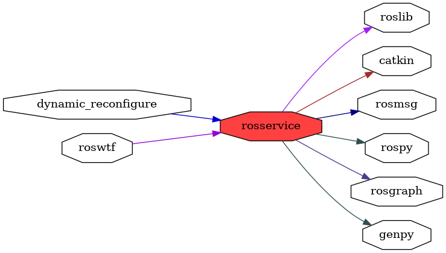

<!--
File was automatically generated using 'ros-diagram-tools' project.
Project is distributed under the BSD 3-Clause license.
-->

## packages graph

|     |     |
| --- | --- |
| Package path: | `/opt/ros/noetic/share/rosservice` |
| Nodes: | `` |
| Graph packages (8): | Description: |
| ----------------------------------- | ------------ |
| [`dynamic_reconfigure`](dynamic_reconfigure.html) |  |
| [`genpy`](genpy.html) |  |
| [`rosgraph`](rosgraph.html) |  |
| [`roslib`](roslib.html) |  |
| [`rosmsg`](rosmsg.html) |  |
| [`rospy`](rospy.html) |  |
| [`rosservice`](rosservice.html) |  |
| [`roswtf`](roswtf.html) |  |

 
File was automatically generated using [*ros-diagram-tools*](https://github.com/anetczuk/ros-diagram-tools) project.
Project is distributed under the BSD 3-Clause license.
