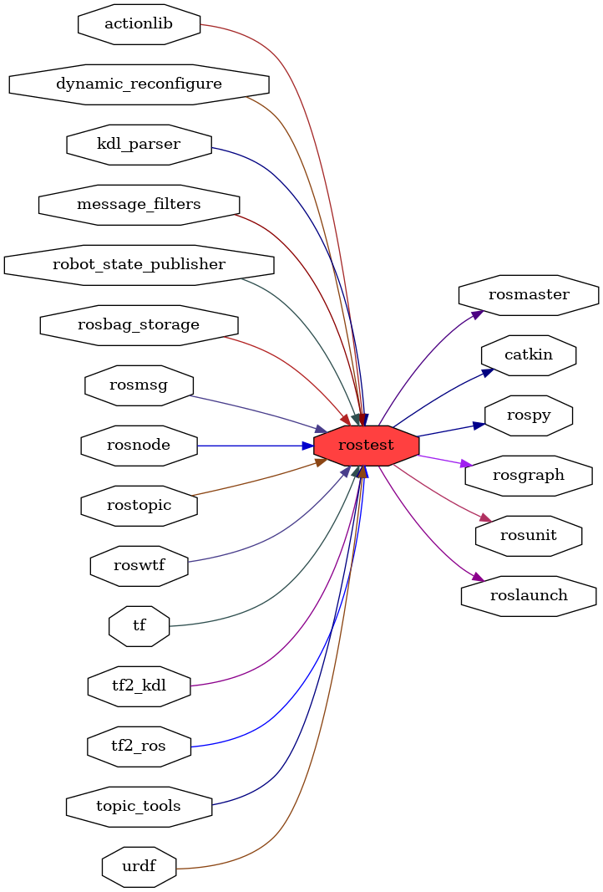

<!--
File was automatically generated using 'ros-diagram-tools' project.
Project is distributed under the BSD 3-Clause license.
-->

## packages graph

|     |     |
| --- | --- |
| Package path: | `/opt/ros/noetic/share/rostest` |
| Nodes: | `` |

| Graph packages (22): | Description: |
| -------------------- | ------------ |
| [`actionlib`](actionlib.md) |  |
| [`catkin`](catkin.md) |  |
| [`dynamic_reconfigure`](dynamic_reconfigure.md) |  |
| [`kdl_parser`](kdl_parser.md) |  |
| [`message_filters`](message_filters.md) |  |
| [`robot_state_publisher`](robot_state_publisher.md) |  |
| [`rosbag_storage`](rosbag_storage.md) |  |
| [`rosgraph`](rosgraph.md) |  |
| [`roslaunch`](roslaunch.md) |  |
| [`rosmaster`](rosmaster.md) |  |
| [`rosmsg`](rosmsg.md) |  |
| [`rosnode`](rosnode.md) |  |
| [`rospy`](rospy.md) |  |
| [`rostest`](rostest.md) |  |
| [`rostopic`](rostopic.md) |  |
| [`rosunit`](rosunit.md) |  |
| [`roswtf`](roswtf.md) |  |
| [`tf`](tf.md) |  |
| [`tf2_kdl`](tf2_kdl.md) |  |
| [`tf2_ros`](tf2_ros.md) |  |
| [`topic_tools`](topic_tools.md) |  |
| [`urdf`](urdf.md) |  |

 

File was automatically generated using <a href="https://github.com/anetczuk/ros-diagram-tools"><i>ros-diagram-tools</i></a> project.
Project is distributed under the BSD 3-Clause license.

