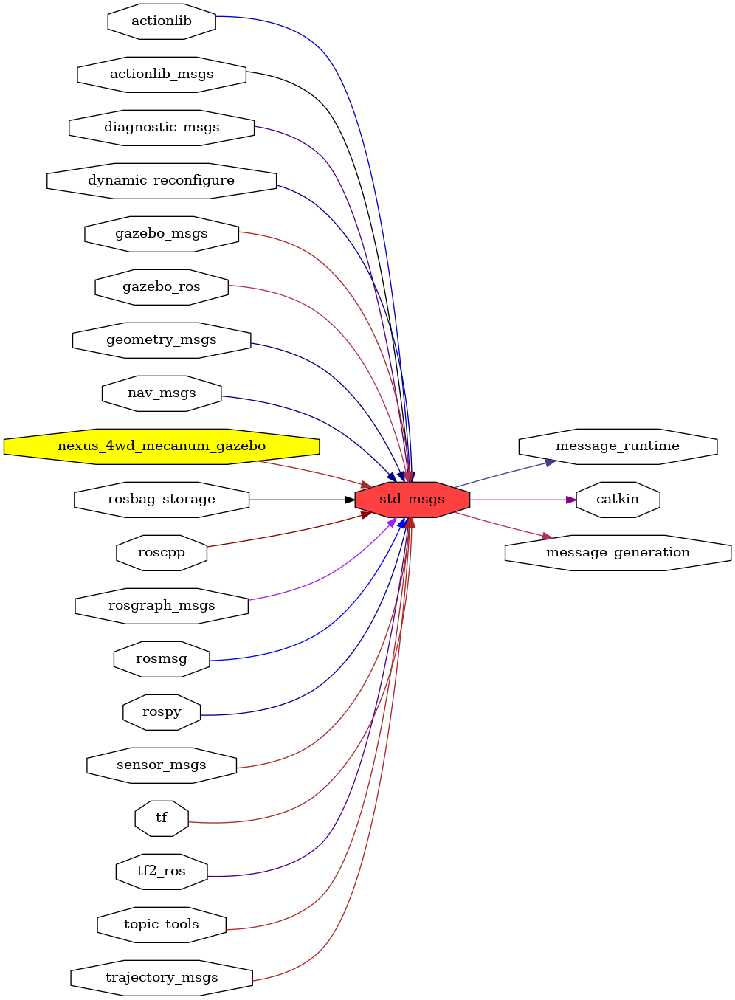

<!--
File was automatically generated using 'ros-diagram-tools' project.
Project is distributed under the BSD 3-Clause license.
-->

## packages graph

|     |     |
| --- | --- |
| Package path: | `/opt/ros/noetic/share/std_msgs` |
| Nodes: | `` |

| Graph packages (23): | Description: |
| -------------------- | ------------ |
| [`actionlib`](actionlib.md) |  |
| [`actionlib_msgs`](actionlib_msgs.md) |  |
| [`catkin`](catkin.md) |  |
| [`diagnostic_msgs`](diagnostic_msgs.md) |  |
| [`dynamic_reconfigure`](dynamic_reconfigure.md) |  |
| [`gazebo_msgs`](gazebo_msgs.md) | Gazebo package |
| [`gazebo_ros`](gazebo_ros.md) | Gazebo package |
| [`geometry_msgs`](geometry_msgs.md) |  |
| [`message_generation`](message_generation.md) |  |
| [`message_runtime`](message_runtime.md) |  |
| [`nav_msgs`](nav_msgs.md) |  |
| [`nexus_4wd_mecanum_gazebo`](nexus_4wd_mecanum_gazebo.md) |  |
| [`rosbag_storage`](rosbag_storage.md) |  |
| [`roscpp`](roscpp.md) |  |
| [`rosgraph_msgs`](rosgraph_msgs.md) |  |
| [`rosmsg`](rosmsg.md) |  |
| [`rospy`](rospy.md) |  |
| [`sensor_msgs`](sensor_msgs.md) |  |
| [`std_msgs`](std_msgs.md) |  |
| [`tf`](tf.md) |  |
| [`tf2_ros`](tf2_ros.md) |  |
| [`topic_tools`](topic_tools.md) |  |
| [`trajectory_msgs`](trajectory_msgs.md) |  |

 

File was automatically generated using <a href="https://github.com/anetczuk/ros-diagram-tools"><i>ros-diagram-tools</i></a> project.
Project is distributed under the BSD 3-Clause license.

