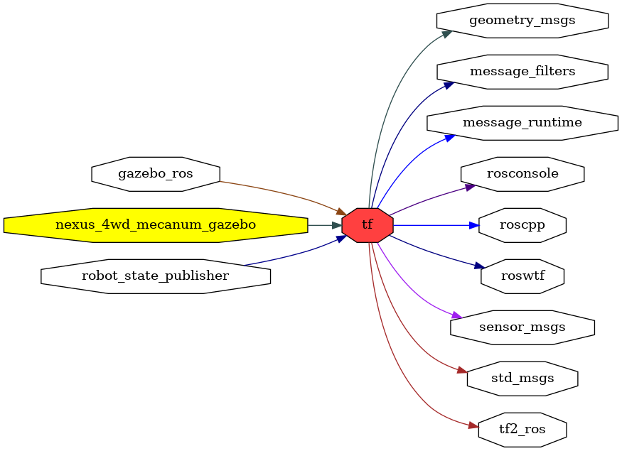

<!--
File was automatically generated using 'ros-diagram-tools' project.
Project is distributed under the BSD 3-Clause license.
-->

## packages graph

|     |     |
| --- | --- |
| Package path: | `/opt/ros/noetic/share/tf` |
| Nodes: | `` |

| Graph packages (13): | Description: |
| -------------------- | ------------ |
| [`gazebo_ros`](gazebo_ros.html) | Gazebo package |
| [`geometry_msgs`](geometry_msgs.html) |  |
| [`message_filters`](message_filters.html) |  |
| [`message_runtime`](message_runtime.html) |  |
| [`nexus_4wd_mecanum_gazebo`](nexus_4wd_mecanum_gazebo.html) |  |
| [`robot_state_publisher`](robot_state_publisher.html) |  |
| [`rosconsole`](rosconsole.html) |  |
| [`roscpp`](roscpp.html) |  |
| [`roswtf`](roswtf.html) |  |
| [`sensor_msgs`](sensor_msgs.html) |  |
| [`std_msgs`](std_msgs.html) |  |
| [`tf`](tf.html) |  |
| [`tf2_ros`](tf2_ros.html) |  |

 

File was automatically generated using <a href="https://github.com/anetczuk/ros-diagram-tools"><i>ros-diagram-tools</i></a> project.
Project is distributed under the BSD 3-Clause license.

