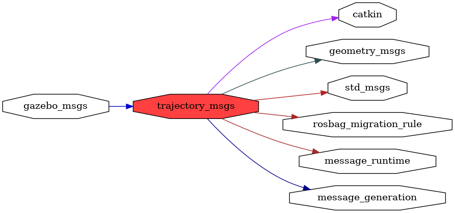

<!--
File was automatically generated using 'ros-diagram-tools' project.
Project is distributed under the BSD 3-Clause license.
-->

## packages graph

|     |     |
| --- | --- |
| Package path: | `/opt/ros/noetic/share/trajectory_msgs` |
| Nodes: | `` |
| Graph packages (6): | Description: |
| ----------------------------------- | ------------ |
| [`gazebo_msgs`](gazebo_msgs.html) | Gazebo package |
| [`geometry_msgs`](geometry_msgs.html) |  |
| [`message_runtime`](message_runtime.html) |  |
| [`rosbag_migration_rule`](rosbag_migration_rule.html) |  |
| [`std_msgs`](std_msgs.html) |  |
| [`trajectory_msgs`](trajectory_msgs.html) |  |

 
File was automatically generated using [*ros-diagram-tools*](https://github.com/anetczuk/ros-diagram-tools) project.
Project is distributed under the BSD 3-Clause license.
