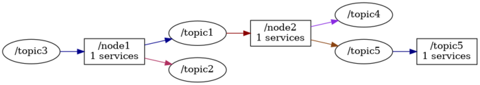

# Generic examples of diagrams

Simple samples of varius diagrams.

## Generation

Script `generate-all.sh` generates diagrams and views from duped data.

## `codedistribution`

## `packagetree`

Generated diagram:

*HTML* [output](catkinlist/out/full_graph.html).

*Markdown* [output](catkinlist/out/full_graph.md).

## `rosnodegraph`

Generated full diagram:

*HTML* [output](rosnodelist/out/full_graph.html).

*Markdown* [output](rosnodelist/out/full_graph.md).

## `rostopicgraph`

