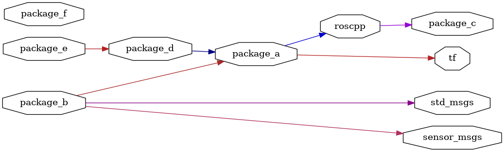

<!--
File was automatically generated using 'ros-diagram-tools' project.
Project is distributed under the BSD 3-Clause license.
-->

## packages graph

| Graph packages (10): | Description: |
| ----------------------------------- | ------------ |
| [`package_a`](nodes/package_a.html) |  |
| [`package_b`](nodes/package_b.html) |  |
| [`package_c`](nodes/package_c.html) | important package |
| [`package_d`](nodes/package_d.html) |  |
| [`package_e`](nodes/package_e.html) |  |
| [`package_f`](nodes/package_f.html) |  |
| [`roscpp`](nodes/roscpp.html) | other important package |
| [`sensor_msgs`](nodes/sensor_msgs.html) |  |
| [`std_msgs`](nodes/std_msgs.html) |  |
| [`tf`](nodes/tf.html) |  |

 
File was automatically generated using [*ros-diagram-tools*](https://github.com/anetczuk/ros-diagram-tools) project.
Project is distributed under the BSD 3-Clause license.
