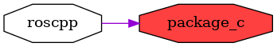

<!--
File was automatically generated using 'ros-diagram-tools' project.
Project is distributed under the BSD 3-Clause license.
-->

## packages graph

| Graph packages (2): | Description: |
| ----------------------------------- | ------------ |
| [`package_c`](package_c.html) | important package |
| [`roscpp`](roscpp.html) | other important package |

 
File was automatically generated using [*ros-diagram-tools*](https://github.com/anetczuk/ros-diagram-tools) project.
Project is distributed under the BSD 3-Clause license.
