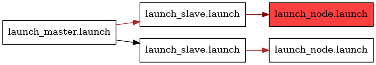

<!--
File was automatically generated using 'ros-diagram-tools' project.
Project is distributed under the BSD 3-Clause license.
-->

## Node

Launch file: /launch_node.launch

#### Resolved arguments (2):

| Argument | Value |
| -------- | ----- |
| arg_node_def | `aaa` |
| arg_node_req | `node_ssss1` |

#### Nodes (1):

|     |     |
| --- | --- |
| Node name: | `node_node_ssss1` |
| Package: | `rospy_tutorials` |
| Args: | `--test` |
| Respawn: | `True` |
| Respawn delay: | `0.0` |
| Required: | `False` |
| Launch file: | `/launch_node.launch` |
| Remap args: | `[]` |

 

File was automatically generated using <a href="https://github.com/anetczuk/ros-diagram-tools"><i>ros-diagram-tools</i></a> project.
Project is distributed under the BSD 3-Clause license.

