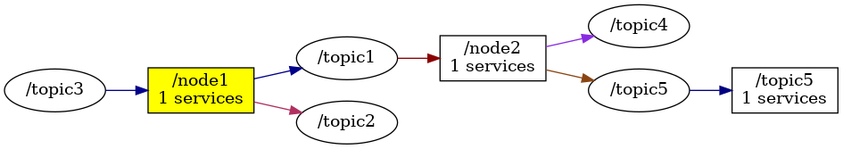

<!--
File was automatically generated using 'ros-diagram-tools' project.
Project is distributed under the BSD 3-Clause license.
-->

## Main graph

| ROS nodes (3): | Package: | Description: |
| -------------- | -------- | ------------ |
| [`/node1`](nodes/n__node1.md) |  |  |
| [`/node2`](nodes/n__node2.md) |  | description example |
| [`/topic5`](nodes/n__topic5.md) |  | other important node |

| ROS topics (5): | Description: |
| --------------- | ------------ |
| [`/topic1`](nodes/t__topic1.md) |  |
| [`/topic2`](nodes/t__topic2.md) |  |
| [`/topic3`](nodes/t__topic3.md) | important topic |
| [`/topic4`](nodes/t__topic4.md) |  |
| [`/topic5`](nodes/t__topic5.md) | description of other topic |

| ROS services (3): | Description: |
| ----------------- | ------------ |
| [`/service1`](nodes/s__service1.md) |  |
| [`/service2`](nodes/s__service2.md) | service waiting for call |
| [`/service3`](nodes/s__service3.md) |  |

 

File was automatically generated using <a href="https://github.com/anetczuk/ros-diagram-tools"><i>ros-diagram-tools</i></a> project.
Project is distributed under the BSD 3-Clause license.

