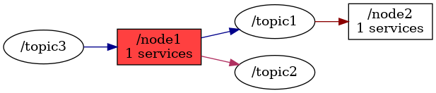

<!--
File was automatically generated using 'ros-diagram-tools' project.
Project is distributed under the BSD 3-Clause license.
-->

## Node

| ROS nodes (2): | Description: |
| -------------- | ------------ |
| [`/node1`](n__node1.md) |  |
| [`/node2`](n__node2.md) | description example |

| ROS topics (3): | Description: |
| --------------- | ------------ |
| [`/topic1`](t__topic1.md) |  |
| [`/topic2`](t__topic2.md) |  |
| [`/topic3`](t__topic3.md) | important topic |

| ROS services (1): | Description: |
| ----------------- | ------------ |
| [`/service1`](s__service1.md) |  |

 

File was automatically generated using <a href="https://github.com/anetczuk/ros-diagram-tools"><i>ros-diagram-tools</i></a> project.
Project is distributed under the BSD 3-Clause license.

