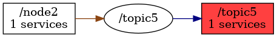

<!--
File was automatically generated using 'ros-diagram-tools' project.
Project is distributed under the BSD 3-Clause license.
-->

## Node

| ROS nodes (2): | Description: |
| -------------- | ------------ |
| [`/node2`](n__node2.md) | description example |
| [`/topic5`](n__topic5.md) | other important node |

| ROS topics (1): | Description: |
| --------------- | ------------ |
| [`/topic5`](t__topic5.md) | description of other topic |

| ROS services (1): | Description: |
| ----------------- | ------------ |
| [`/service3`](s__service3.md) |  |

 

File was automatically generated using <a href="https://github.com/anetczuk/ros-diagram-tools"><i>ros-diagram-tools</i></a> project.
Project is distributed under the BSD 3-Clause license.

