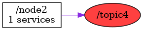

<!--
File was automatically generated using 'ros-diagram-tools' project.
Project is distributed under the BSD 3-Clause license.
-->

## Topic

|     |     |
| --- | --- |
| Topic name: | `/topic4` |
| Data type: | `message_xxx1` |
| Publishers: | `/node2` |
| Subscribers: | `` |

| ROS nodes (1): | Description: |
| -------------- | ------------ |
| [`/node2`](n__node2.html) | description example |

| ROS topics (1): | Description: |
| --------------- | ------------ |
| [`/topic4`](t__topic4.html) |  |

 

File was automatically generated using <a href="https://github.com/anetczuk/ros-diagram-tools"><i>ros-diagram-tools</i></a> project.
Project is distributed under the BSD 3-Clause license.

